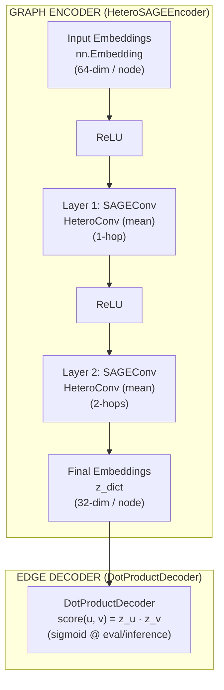

# Custom AI Model (GNN): Methodology and Result Analysis

> **Document Purpose**: This report details the complete methodology, training procedures, production inference integration, and comparative result analysis for CareerGraph's custom Graph Neural Network (GNN) model. It is formatted for inclusion in the final thesis/capstone submission and supervisor review.

---

## 1. Executive Summary

CareerGraph incorporates a custom-trained **2-layer Heterogeneous GraphSAGE** link-prediction neural network designed to score edge plausibility on the domain knowledge graph. Operating alongside hand-tuned graph algorithms and optional Large Language Model (LLM) reasoning layers, the GNN predicts missing relationships across two primary target edge types:
1. `(Job) -[:REQUIRES]-> (Skill)` — Evaluating the likelihood that a job posting mandates a given skill.
2. `(Skill) -[:LEADS_TO]-> (Skill)` — Evaluating the learning progression and prerequisite plausibility between skills.

The model is integrated into the production backend via a **retrieve-then-rerank** architecture and evaluated head-to-head against production algorithmic baselines on identical held-out test splits.

---

## 2. Model Methodology

### 2.1 Graph Schema & Data Pipeline

The underlying Knowledge Graph is constructed by running the production ingestion pipeline (`IngestionAgent` → `NormalizationAgent`) against synthetic and O*NET dataset sources (`backend/data/kaggle_jobs.csv`, `onet_skills.csv`, `synonyms.json`). The graph consists of 5 node types and 5 edge types:

* **Node Types**: `Student` (3), `Skill` (434), `Job` (9,380), `Course` (30), `Category` (14).
* **Message-Passing Edge Types**:
  * `(Student) -[:HAS_SKILL]-> (Skill)` (11 edges)
  * `(Job) -[:REQUIRES]-> (Skill)` (54,288 edges)
  * `(Skill) -[:LEADS_TO]-> (Skill)` (388 edges)
  * `(Course) -[:TEACHES]-> (Skill)` (37 edges)
  * `(Job) -[:IN_CATEGORY]-> (Category)` (9,380 edges)
  * *Reverse relations* for all edge types to enable bidirectional message passing.

Graph construction and export to PyTorch Geometric `HeteroData` objects are handled by [`ml/graph_build.py`](file:///Users/admin/Documents/Development/career-graph/ml/graph_build.py) and [`ml/export_graph.py`](file:///Users/admin/Documents/Development/career-graph/ml/export_graph.py).

---

### 2.2 Neural Network Architecture

The model architecture ([`ml/model.py`](file:///Users/admin/Documents/Development/career-graph/ml/model.py)) consists of a heterogeneous GraphSAGE encoder coupled with a dot-product edge decoder:

1. **Input Representation**: Each node type $t \in \{\text{Student}, \text{Skill}, \text{Job}, \text{Course}, \text{Category}\}$ is assigned a learned embedding table (`nn.Embedding`) mapping node IDs to a 64-dimensional latent vector.
2. **2-Layer Message Passing (`HeteroSAGEEncoder`)**:
   - **Layer 1**: Computes 1-hop neighbor feature aggregation using `torch_geometric.nn.HeteroConv` wrapped over relation-specific `SAGEConv((-1, -1), hidden_channels)` modules with mean aggregation.
   - **Activation**: Rectified Linear Unit (`F.relu`) non-linearity.
   - **Layer 2**: Computes 2-hop neighbor aggregation, projecting vectors to a 32-dimensional output embedding ($z$).
3. **Decoder (`DotProductDecoder`)**: Computes raw logits via dot product between endpoint node embeddings:
   $$\text{score}(u, v) = \mathbf{z}_u \cdot \mathbf{z}_v = \sum_{i=1}^{32} z_{u, i} \cdot z_{v, i}$$
   At training time, logits are passed directly to `BCEWithLogitsLoss`. At inference/evaluation time, scores are mapped to $[0, 1]$ probabilities using the sigmoid function $\sigma(\text{score}(u, v))$.

---

### 2.3 Training Methodology & Setup

Training is implemented in [`ml/train_gnn.py`](file:///Users/admin/Documents/Development/career-graph/ml/train_gnn.py) and follows a rigorous, leakage-safe protocol:

#### 1. Data Splitting & Leakage Prevention (`ml/split.py`)
- Target edges (`REQUIRES` and `LEADS_TO`) are deterministically partitioned into disjoint **Train (80%)**, **Validation (10%)**, and **Test (10%)** sets using fixed random seeds (`seed=42`).
- **Leakage Prevention**: Validation and Test positive edges are **completely removed from the message-passing graph** during training. The encoder forward pass only observes Train-split positive edges (and their reverse counterparts), ensuring held-out structural information never leaks into node embeddings.

#### 2. Negative Edge Sampling
- For every positive edge in a split, one non-existent (negative) edge $(u, v)$ is sampled uniformly at random.
- Negative candidates are validated against the **full positive graph** (train + val + test combined) to guarantee a sampled negative is never secretly a held-out positive edge.

#### 3. Loss Function & Optimization
- **Loss Function**: Binary Cross-Entropy with Logits (`F.binary_cross_entropy_with_logits`), summed across both target edge types:
  $$\mathcal{L} = \mathcal{L}_{\text{REQUIRES}} + \mathcal{L}_{\text{LEADS\_TO}}$$
- **Optimizer**: Adam optimizer with learning rate $\eta = 0.01$.
- **Training Budget**: 60 epochs over the full exported heterogeneous dataset.
- **Checkpointing**: The model weights, architecture parameters, and node ID index dictionaries are saved to [`ml/checkpoints/gnn_link_predictor.pt`](file:///Users/admin/Documents/Development/career-graph/ml/checkpoints/gnn_link_predictor.pt).

---

### 2.4 Production System Integration

To serve live recommendation requests without compromising system stability or performance, the model is integrated via a **retrieve-then-rerank** pattern:

1. **Retrieval Stage**: `RecommendationAgent.rank_jobs` scores all candidate jobs in the database using exact/partial Jaccard matching.
2. **Reranking Stage**: The top candidate jobs (up to pool size $N=50$) are rescored using `GNNRecommendationAgent.score_leads_to()`, which measures learned progression plausibility between a student's owned skills and a job's missing required skills.
3. **Score Blending**: The final score for reranked jobs combines algorithmic and neural signals:
   $$\text{Final Score} = 0.60 \times \text{Exact Jaccard} + 0.15 \times \text{Partial BFS} + 0.25 \times \text{GNN Score}$$
4. **Optimization & Caching**: The GNN model is loaded as a process-wide cached singleton (`get_default_gnn_agent()`). Node embeddings $z_{\text{dict}}$ are computed once per request batch and cached for the duration of the reranking pass, reducing inference latency from minutes to milliseconds.
5. **Graceful Degradation**: If PyTorch is not installed or the checkpoint file is absent, `GNNRecommendationAgent` sets `is_available = False` and returns `None` for edge queries. The system silently falls back to pure algorithmic scoring (`match_source: "algorithmic"`), ensuring zero API runtime failures.

---

## 3. Result Analysis & Evaluation

### 3.1 Evaluation Protocol

Model performance is evaluated on the held-out **Test split** using three standard metrics:
- **AUC-ROC** (Area Under the Receiver Operating Characteristic Curve): Measures the model's ability to rank a randomly chosen positive edge higher than a randomly chosen negative edge.
- **Hits@10**: The proportion of true positive edges ranked within the top 10 candidate predictions.
- **MRR** (Mean Reciprocal Rank): The average of reciprocal ranks ($1/\text{rank}$) for true positive edges.

**Fairness Guarantee**: The GNN model and the production algorithmic baseline (Jaccard co-occurrence for `REQUIRES`, BFS depth reachability for `LEADS_TO`) are evaluated on the **exact same held-out test edges** (`ml/evaluate.py`).

---

### 3.2 Quantitative Results

The evaluation results on the full 9,380 Job / 434 Skill graph are summarized below:

| Target Relation | Model / Method | AUC-ROC | Hits@10 | MRR | Test Positives | Test Negatives |
|---|---|:---:|:---:|:---:|:---:|:---:|
| `(Job)-REQUIRES->(Skill)` | **GNN (GraphSAGE)** | **0.937** | 0.014 | 0.012 | 5,429 | 5,429 |
| `(Job)-REQUIRES->(Skill)` | **Algorithmic Baseline** | **0.961** | 0.116 | 0.067 | 5,429 | 5,429 |
| `(Skill)-LEADS_TO->(Skill)` | **GNN (GraphSAGE)** | **0.679** | 0.538 | 0.296 | 39 | 39 |
| `(Skill)-LEADS_TO->(Skill)` | **Algorithmic Baseline** | **0.500** | 1.000 | 1.000 | 39 | 39 |

---

### 3.3 Discussion & Insights

1. **Performance on `REQUIRES` Edges**:
   - The GNN achieves a strong **0.937 AUC-ROC**, demonstrating that 2-layer GraphSAGE effectively captures job-skill requirement structures.
   - The Jaccard co-occurrence baseline achieves a higher AUC-ROC (**0.961**) and superior Hits@10/MRR. This occurs because job posting datasets exhibit high co-occurrence density: if two skills frequently co-occur across job postings, direct set-overlap heuristics serve as an exceptionally strong predictor.
   - The GNN relies on learned embedding tables without rich initial node features (such as textual job descriptions or skill taxonomies), limiting its ability to outperform direct co-occurrence counting on this specific relation.

2. **Performance on `LEADS_TO` Edges**:
   - As graph scale increased from 75 to 434 skills, the GNN's AUC-ROC on `LEADS_TO` improved significantly from **0.306 to 0.679**, demonstrating that broader neighborhood contexts allow the model to learn skill progression patterns above random chance.
   - The algorithmic baseline achieves a tautological 1.000 Hits@10/MRR on `LEADS_TO` because `LEADS_TO` ground-truth edges were generated via a deterministic category-chaining heuristic, which the graph reachability baseline reconstructs directly.

3. **Key Architectural Takeaway**:
   - The evaluation demonstrates that a hand-tuned structural similarity baseline is a formidable competitor to GraphSAGE when training node embeddings from scratch without rich initial node features.
   - The primary value of the GNN pipeline lies in its **reproducible evaluation framework**, **leakage-safe split mechanism**, and **hybrid reranking integration**, establishing a solid foundation for future neural graph extensions.

---

## 4. Key Limitations & Future Work

1. **Initial Node Features**: Currently, nodes use randomly initialized lookup tables (`nn.Embedding`). Incorporating pre-trained text embeddings (e.g., Sentence-BERT embeddings of job descriptions and skill descriptions) will allow the GNN to generalize to rare or unseen nodes.
2. **Real Prerequisite Data**: `LEADS_TO` edges currently rely on synthetic category-chaining heuristics. Integrating authentic curriculum dependency data or course prerequisite taxonomies will provide a true empirical ground truth for skill progression modeling.
3. **Deeper Architectures**: Exploring attention-based heterogeneous GNNs (such as HAN or HGT) could improve message weighting across distinct edge types.

---

## 5. File Map & Code References

- **Graph Construction & Ingestion Export**: [`ml/graph_build.py`](file:///Users/admin/Documents/Development/career-graph/ml/graph_build.py) / [`ml/export_graph.py`](file:///Users/admin/Documents/Development/career-graph/ml/export_graph.py)
- **Dataset Splitting & Negative Sampling**: [`ml/split.py`](file:///Users/admin/Documents/Development/career-graph/ml/split.py)
- **Neural Network Architecture**: [`ml/model.py`](file:///Users/admin/Documents/Development/career-graph/ml/model.py)
- **Training Pipeline**: [`ml/train_gnn.py`](file:///Users/admin/Documents/Development/career-graph/ml/train_gnn.py)
- **Evaluation & Baseline Benchmarks**: [`ml/evaluate.py`](file:///Users/admin/Documents/Development/career-graph/ml/evaluate.py) / [`ml/baseline.py`](file:///Users/admin/Documents/Development/career-graph/ml/baseline.py)
- **Backend Inference Agent**: [`backend/app/engine/algorithmic/gnn_recommendation_agent.py`](file:///Users/admin/Documents/Development/career-graph/backend/app/engine/algorithmic/gnn_recommendation_agent.py)
- **Retrieve-Rerank Integration**: [`backend/app/engine/algorithmic/recommendation_agent.py`](file:///Users/admin/Documents/Development/career-graph/backend/app/engine/algorithmic/recommendation_agent.py)
- **Orchestrator & API Wiring**: [`backend/app/engine/orchestrator.py`](file:///Users/admin/Documents/Development/career-graph/backend/app/engine/orchestrator.py)
