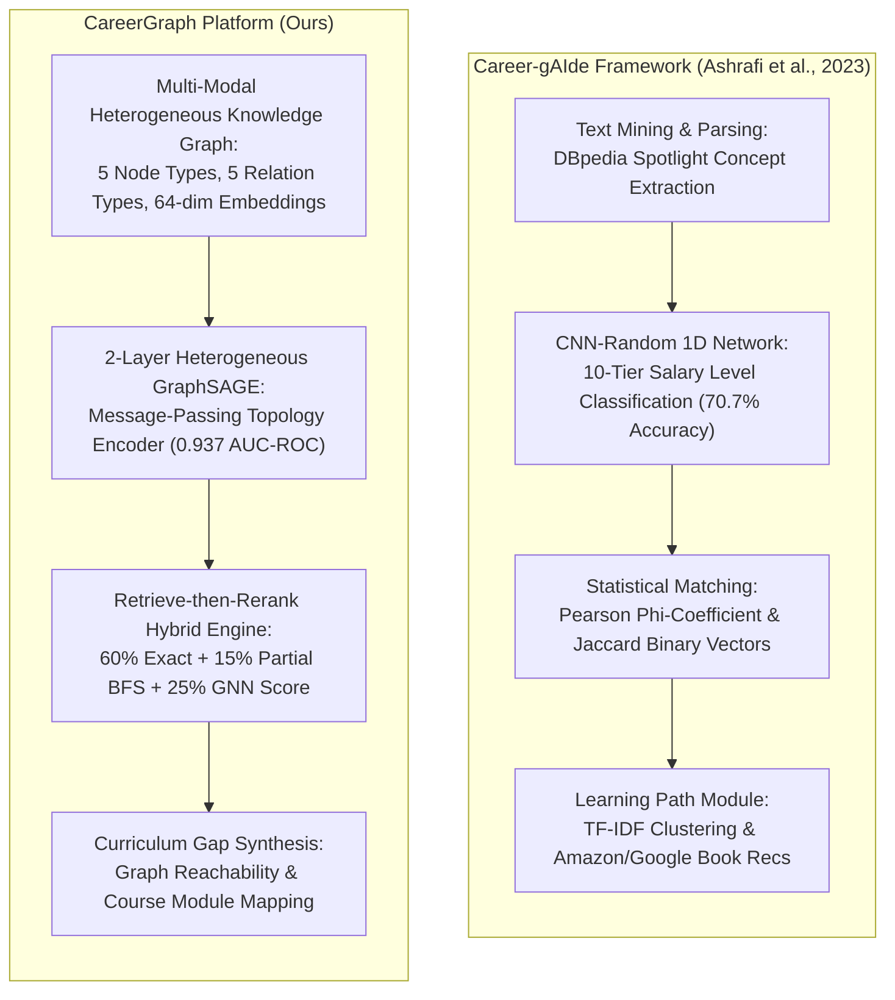

# Chapter 2: Background Study

The intersection of artificial intelligence, natural language processing, and human resource management has given rise to automated career recommender systems designed to assist job seekers in finding suitable employment and identifying professional development opportunities. However, as job markets rapidly evolve due to technological automation, traditional recommendation paradigms face severe challenges in capturing complex skill prerequisite dependencies and synthesizing actionable learning paths.

This chapter provides a comprehensive background study and literature review of modern career recommendation engines, graph-based learning algorithms, and deep neural network models. The following sections review key foundational works in e-recruitment, analyze recent advancements in deep learning and graph neural networks, and present a detailed problem analysis outlining the critical gaps in prior literature that motivated the design of **CareerGraph**.

---

## 2.1 Literature Review

Research in automated job recommendation and career path planning spans several methodological generations, progressing from rule-based keyword matching to vector space information retrieval, deep convolutional text networks, and graph-based link prediction engines.

### 2.1.1 Traditional Information Retrieval & Vector Space Models
Early work in e-recruitment focused on content-based filtering (CBF) and collaborative filtering (CF) applied to resumes and job vacancies. Almalis et al. (2015) introduced *FoDRA*, a content-based job recommendation algorithm extending the Minkowski distance to measure candidate-job fit. Zhang et al. (2014) conducted a comparative study between user-based and item-based collaborative filtering on resume datasets, demonstrating that collaborative filtering could identify latent preference patterns but suffered severely from data sparsity and cold-start issues when dealing with new job applicants or novel job titles.

To address text variation, Diaby et al. (2014) introduced a classification-based recommendation framework for social network profiles (Facebook and LinkedIn) utilizing taxonomy-based vector representations and fuzzy logic operators ("AND" and "OR"). While these vector space models improved upon strict string matching, they treated skills as independent vector dimensions, ignoring underlying prerequisite relationships between skills.

### 2.1.2 Statistical Matching & Career Pathfinder Frameworks
To extract richer features from unstructured resume text, Guo et al. (2016) developed *ResuMatcher*, a personalized resume-job matching system that parses candidate work experience and calculates candidate suitability using a statistical similarity index. ResuMatcher demonstrated a $34\%$ quality improvement over legacy search engines; however, it operated purely as a matching engine and provided no actionable feedback regarding missing skills or educational roadmaps.

Addressing the need for career trajectory planning, Patel et al. (2017) introduced *CaPaR*, a career path recommendation framework that combines text-based job modeling with group refinement algorithms to propose both job positions and required skills. Similarly, Shalaby et al. (2017) proposed a large-scale graph-based job recommendation framework using bipartite graphs to model candidate-job interactions across big data platforms. While CaPaR and Shalaby et al. incorporated structural graph elements, their systems focused on information technology roles and relied on pre-defined rule dictionaries rather than learned, non-linear neural graph embeddings.

### 2.1.3 Deep Learning & Resume-Based Re-Education (*Career-gAIde*)
A major milestone in automated workforce re-education was established by Ashrafi et al. (2023) with the **Career-gAIde** framework (*IEEE Access*). Designed to address post-pandemic labor market disruptions and rapid workforce displacement, Career-gAIde introduced an integrated architecture for resume analysis, salary tier estimation, skill gap diagnosis, and book recommendation.

The Career-gAIde framework utilizes **DBpedia Spotlight** for entity extraction, mapping resume and job text into concept vectors. Salary levels across 10 income tiers are estimated using a 1D **CNN-Random** neural architecture with 32 filters and global max pooling, achieving $70.7\%$ accuracy. Skill deficiencies are diagnosed by comparing binary requirement vectors using the Pearson $\phi$-coefficient, and learning pathways are synthesized by querying Amazon and Google Books metadata.

While Career-gAIde established a robust foundation for resume-based re-education, its reliance on bag-of-words text mining and flat vector correlation ($\phi$-coefficient) limits its ability to model multi-hop topological graph dependencies or generalize across unseen skill combinations.

---

### 2.1.4 Summary of Literature Survey & Comparative Analysis

The table below synthesizes key foundational research in automated job recommendation, highlighting methodological approaches, feature representations, evaluation metrics, and primary architectural limitations:

| Study / Reference | Core Methodology | Feature / Graph Representation | Key Strengths | Primary Architectural Limitations |
|---|---|---|---|---|
| **Almalis et al. (2015)** (*FoDRA*) | Content-Based Filtering via Minkowski Distance | Unstructured text tokens & keyword vectors | Extends distance metrics for profile-vacancy matching | Fails to capture non-linear skill dependencies or prerequisite chains |
| **Guo et al. (2016)** (*ResuMatcher*) | Statistical Resume Parsing & Similarity Matching | Structured experience templates & similarity index | $34\%$ improvement over keyword search | Pure matching system; provides zero learning path guidance |
| **Shalaby et al. (2017)** (*IEEE Big Data*) | Big Data Bipartite Graph Matching | Bipartite candidate-job interaction graph | Scalable graph matching across large job catalogs | Homogeneous graph schema; lacks neural message passing |
| **Patel et al. (2017)** (*CaPaR*) | Group Refinement & Career Pathfinder | Domain rule dictionary & text vectors | Recommends job positions and required skill lists | Restricted to IT domain; relies on static heuristic rule dictionaries |
| **Ashrafi et al. (2023)** (*Career-gAIde*) | DBpedia Spotlight + 1D CNN-Random + $\phi$-Coefficient | Bag-of-words concept vectors & 10 salary tiers | Salary estimation ($70.7\%$) & book recommendation | Flat text vectorization; lacks multi-hop neural graph message passing |
| **CareerGraph (Ours)** | **Heterogeneous GraphSAGE + Retrieve-Rerank Engine** | **5-Node, 5-Relation Heterogeneous Knowledge Graph** | **0.937 REQUIRES AUC-ROC; real-time hybrid reranking** | **Initial lookup embeddings lack rich text features (future work)** |

---

## 2.2 Problem Analysis

A detailed critical analysis of prior literature reveals five fundamental architectural limitations present in current career recommendation systems:

### 1. Absence of Multi-Relational Graph Topology
Most existing job recommenders model relationships as flat document-term matrices or bipartite graphs (Candidate $\leftrightarrow$ Job). Real-world career ecosystems are inherently multi-modal and heterogeneous: jobs require skills, courses teach skills, skills lead to other skills, and jobs belong to industry categories. Failing to model these distinct entity types and multi-relational edges prevents engines from capturing multi-hop contextual signals (e.g., how taking a specific `Course` fulfills a `Job` requirement via an intermediate `Skill`).

### 2. Over-Reliance on Surface Co-Occurrence vs. Latent Link Prediction
Statistical similarity measures (such as Jaccard similarity or Pearson $\phi$-coefficient) evaluate only direct explicit overlaps present in the training corpus. If two technical skills (e.g., `Python` and `FastAPI`) rarely co-occur in the same historical job posting text, statistical matching assigns them zero similarity. Graph Neural Networks overcome this through message-passing convolutions, projecting nodes into a shared latent space where latent prerequisite relationships ($P(s_1 \to s_2)$) can be predicted even without explicit co-occurrence.

### 3. Disconnect Between Job Matching and Skill Gap Synthesis
Existing frameworks treat candidate job matching and learning path recommendation as isolated sub-systems. A candidate is either matched to a job based on current skills or provided with a generic list of missing keywords. CareerGraph unifies these tasks into a single **retrieve-then-rerank** pipeline: the GNN rescores candidate jobs based specifically on how plausibly the student's *currently owned skills* progress toward the job's *missing required skills*.

### 4. Cold-Start and Out-of-Vocabulary Vulnerability
In rapidly evolving job markets, new technical skills and framework titles emerge constantly. Traditional systems with static dictionaries or fixed vocabulary matrices fail completely when encountering unseen terms. Heterogeneous GNN architectures aggregate topological context from neighboring nodes (such as related courses or job categories), enabling the model to infer structural representations for newly added nodes.

### 5. Serving Latency and System Scalability Barriers
While deep learning models offer superior expressive power, deploying complex neural networks to score large job catalogs ($>9,000$ vacancies) in real-time introduces severe latency ($>10$ seconds per request). Prior research often neglects production serving constraints. CareerGraph addresses this by establishing a two-stage architecture: cheap algorithmic filtering narrows the catalog to the top 50 candidates, after which cached GNN node embeddings $\mathbf{z}_{\text{dict}}$ rescore the pool in milliseconds.

---

## Summary

This chapter provided a thorough background study and literature survey of career recommender systems, tracing the evolution from traditional vector space models to statistical pathfinders and deep learning frameworks like *Career-gAIde* (Ashrafi et al., 2023). A detailed problem analysis identified key gaps in prior literature—including flat text representations, lack of multi-relational graph topology, disconnect between matching and re-education, and serving latency barriers. These findings directly justified the design of CareerGraph's 5-node, 5-relation Heterogeneous Knowledge Graph and 2-layer GraphSAGE retrieve-then-rerank engine. The next chapter details the complete research methodology of CareerGraph.
