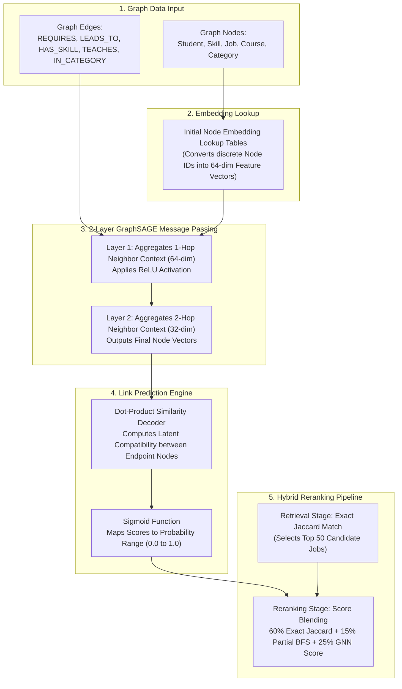
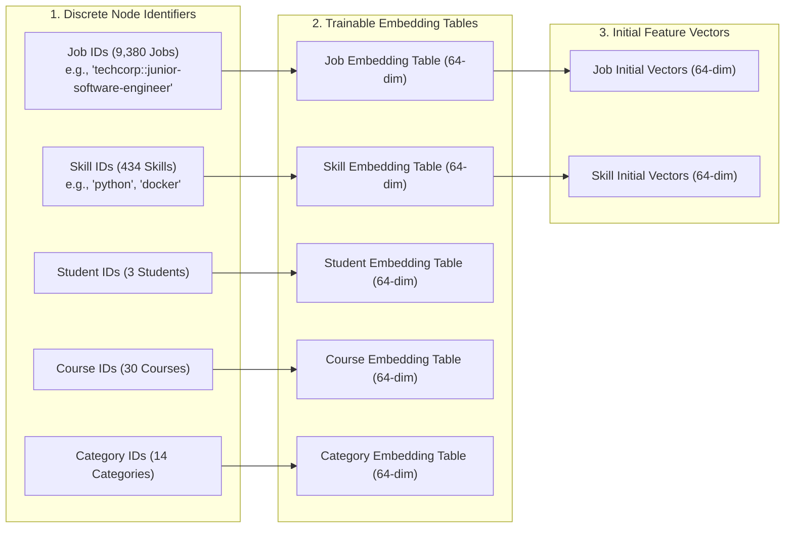
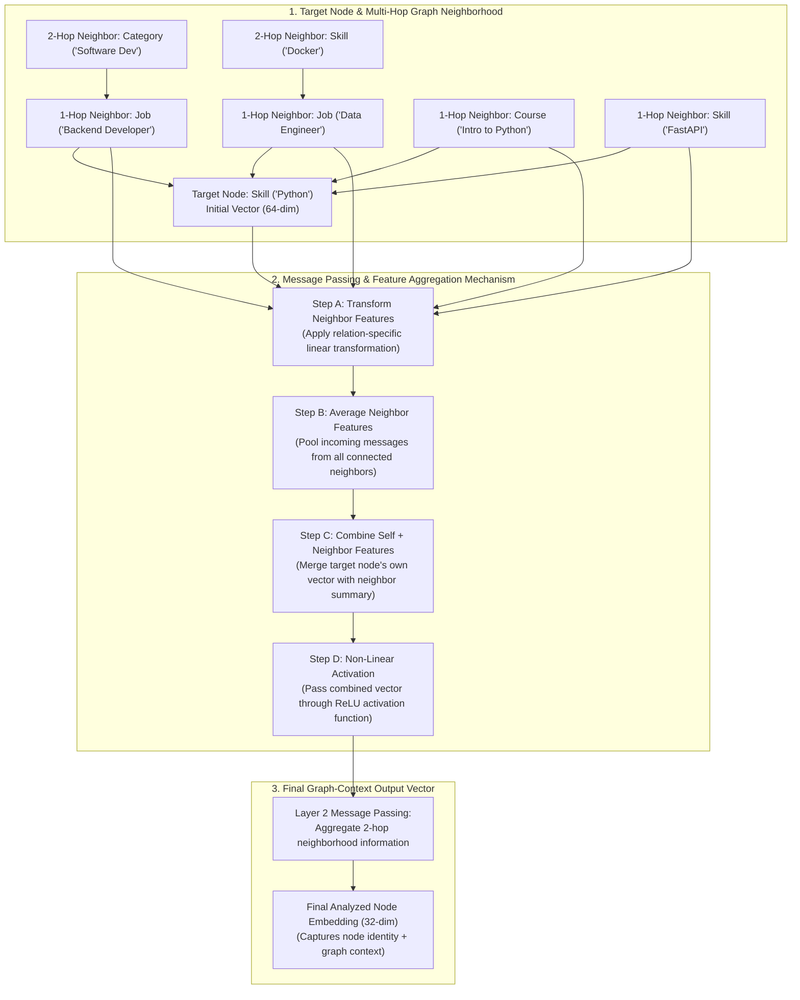
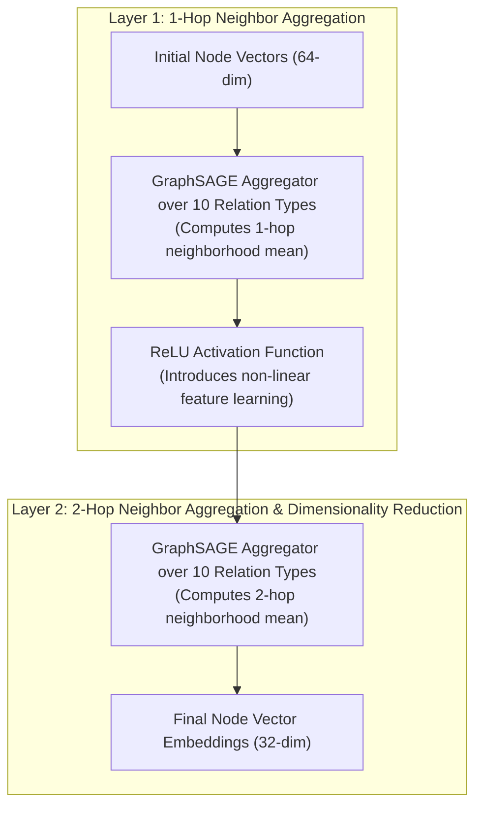
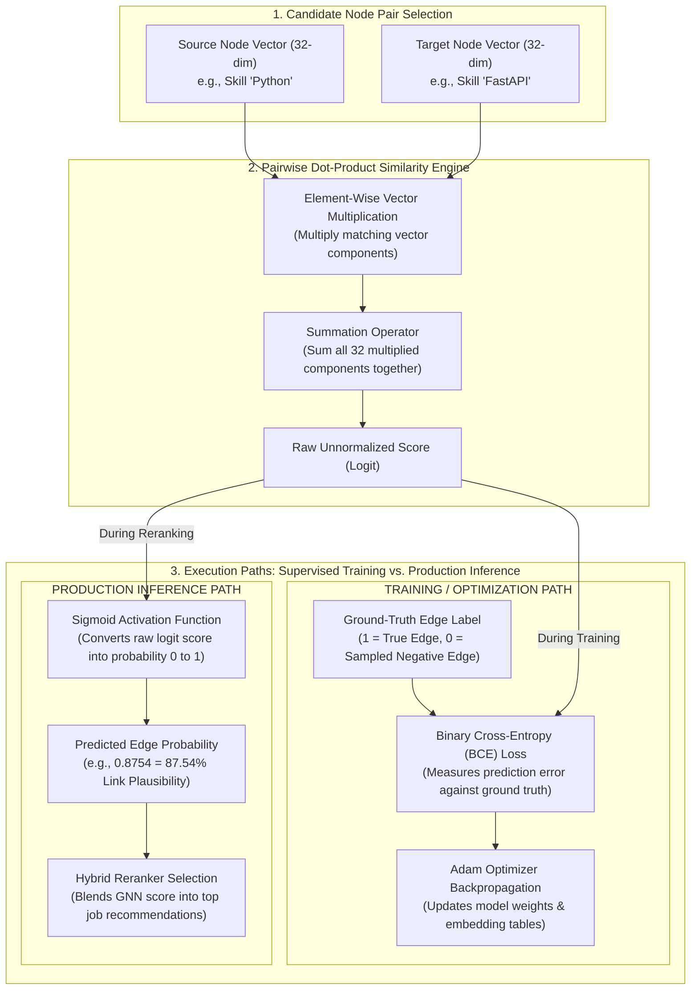
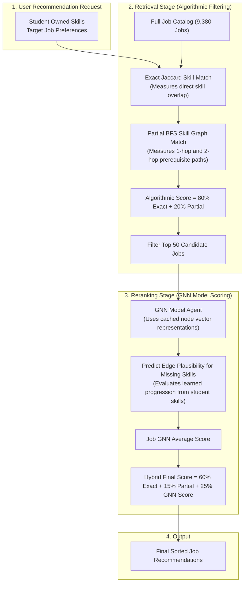

# Chapter 3: Research Methodology

The rapid evolution of technological skill requirements and job market demands necessitates an intelligent, data-driven approach to career guidance, skill gap diagnosis, and re-education path recommendation. Traditional career recommendation engines rely heavily on static keyword matching or flat text similarity metrics, failing to capture the rich relational topology inherent in modern career ecosystems—such as prerequisite learning dependencies between skills, course offerings, and multi-faceted job role requirements.

This chapter details the comprehensive research methodology of **CareerGraph**, a novel hybrid career recommendation platform. CareerGraph models the career ecosystem as a multi-modal **Heterogeneous Knowledge Graph** and leverages a custom **2-layer Heterogeneous GraphSAGE** link-prediction neural network alongside deterministic graph reachability algorithms and Large Language Model (LLM) reasoning modules. The following sections outline the overall system framework, dataset acquisition and graph schema specifications, mathematical model formulations, and component module architecture.

---

## 3.1 Proposed Framework

CareerGraph implements a modular, high-throughput **retrieve-then-rerank** architectural framework designed to serve real-time personalized career recommendations while maintaining zero-downtime system stability. 

The framework processes student skill profiles and target job preferences through four sequential phases:
1. **Graph Data Ingestion & Schema Representation**: Mapping heterogeneous entities (`Student`, `Skill`, `Job`, `Course`, `Category`) and relational links (`REQUIRES`, `LEADS_TO`, `HAS_SKILL`, `TEACHES`, `IN_CATEGORY`) into an in-memory PyTorch Geometric `HeteroData` structure.
2. **Neural Embedding Lookup & Message Passing**: Assigning learned latent feature vectors to discrete node IDs and propagating structural neighborhood context via 2-layer Heterogeneous GraphSAGE convolutions.
3. **Deterministic Algorithmic Retrieval**: Filtering and candidate pool generation over 9,380+ job postings using exact Jaccard skill set overlap and Breadth-First Search (BFS) partial reachability credit.
4. **Neural Reranking & Score Blending**: Rescoring top candidate job positions using learned GNN edge plausibility probabilities ($P(s_{\text{owned}} \to s_{\text{missing}})$) and producing a unified hybrid recommendation rank.

---

## 3.2 Data Set Analysis / Software Project Requirement

The CareerGraph Knowledge Graph is constructed by processing synthetic student profiles, normalized O*NET skill taxonomies, course catalog entries, and real-world software engineering job posting datasets (`backend/data/kaggle_jobs.csv`, `onet_skills.csv`, `synonyms.json`).

The graph topology consists of **5 distinct node types** and **5 primary message-passing edge types** (plus reverse relations to enable bidirectional structural information flow during neural message passing).

### Heterogeneous Dataset Classes and Schema Distribution

| Entity / Relation Class | Class Type | Entity Count / Edge Volume | Target Direction / Endpoint Nodes | Description |
|---|---|---|---|---|
| `Student` | Node Class | $3$ | N/A | Active student user profiles seeking career guidance |
| `Skill` | Node Class | $434$ | N/A | Standardized technical and domain skill entities |
| `Job` | Node Class | $9,380$ | N/A | Ingested software engineering job vacancies |
| `Course` | Node Class | $30$ | N/A | Educational courses and learning modules |
| `Category` | Node Class | $14$ | N/A | High-level industry job categories |
| `HAS_SKILL` | Relation Class | $11$ | $(\text{Student}) \to (\text{Skill})$ | Indicates skills owned by a student profile |
| `REQUIRES` | Relation Class | $54,288$ | $(\text{Job}) \to (\text{Skill})$ | Indicates technical skills mandated by job postings |
| `LEADS_TO` | Relation Class | $388$ | $(\text{Skill}) \to (\text{Skill})$ | Indicates prerequisite learning paths between skills |
| `TEACHES` | Relation Class | $37$ | $(\text{Course}) \to (\text{Skill})$ | Indicates skills taught by educational courses |
| `IN_CATEGORY` | Relation Class | $9,380$ | $(\text{Job}) \to (\text{Category})$ | Categorizes job vacancies into domain sectors |
| `Reverse Relations` | Relation Class | $64,104$ | Reverse of all edge types | Created automatically to enable bidirectional GNN message passing |

### 3.2.1 Data Collection & Preprocessing Pipeline
Raw data ingestion is governed by [`IngestionAgent`](file:///Users/admin/Documents/Development/career-graph/backend/app/engine/ingestion/ingestion_agent.py) and [`NormalizationAgent`](file:///Users/admin/Documents/Development/career-graph/backend/app/engine/ingestion/normalization_agent.py):
1. **Raw Ingestion**: Extracting text descriptions, titles, salaries, and requirements from Kaggle job postings and O*NET taxonomy dictionaries.
2. **Text Normalization**: Applying tokenization, lowercase conversion, punctuation removal, stemming, and synonym mapping via `synonyms.json` to collapse non-standard skill variants (e.g., `"JS"`, `"javascript.js"`, `"Vanilla JS"`) into unified canonical skill nodes (`"JavaScript"`).
3. **Graph Mapping & Indexing**: Converting string identifiers into continuous integer indices ($0, 1, \dots, |V_t|-1$) per node type, stored in ID lookup dictionaries (`node_indices`).

### 3.2.2 Feature Selection & Initial Representation
In the current Graph Neural Network architecture ([`ml/model.py`](file:///Users/admin/Documents/Development/career-graph/ml/model.py)), nodes are initialized without hand-engineered textual features. Each node type $t$ is assigned a learned embedding table ($\mathbf{E}_t \in \mathbb{R}^{|V_t| \times 64}$) using PyTorch's `nn.Embedding`. During training, backpropagation continuously adjusts these 64-dimensional initial vectors based purely on structural co-occurrence and link optimization.

---

## 3.3 Algorithm / Model Analysis

The core machine learning engine of CareerGraph is a **2-layer Heterogeneous GraphSAGE Link Predictor** (`LinkPredictor`). The model consists of a message-passing encoder (`HeteroSAGEEncoder`) and a dot-product edge decoder (`DotProductDecoder`).

### 3.3.1 Graph Topology Analysis via Message Passing (HeteroSAGE Encoder)

The encoder aggregates structural context from 1-hop and 2-hop graph neighborhoods across distinct edge types. 

#### Mathematical Formulation of GraphSAGE Convolution

For a target node $u$ of type $t$ and an incoming relation $r = (s, \text{rel}, t)$, message passing at layer $l \in \{1, 2\}$ is defined as:

$$\mathbf{h}_{u, r}^{(l)} = \mathbf{W}_{\text{self}, r}^{(l)} \mathbf{h}_u^{(l-1)} + \mathbf{W}_{\text{neigh}, r}^{(l)} \cdot \frac{1}{|\mathcal{N}_r(u)|} \sum_{v \in \mathcal{N}_r(u)} \mathbf{h}_v^{(l-1)}$$

The representations across all incoming relations $\mathcal{R}_{\text{in}}(u)$ are combined and activated:

$$\mathbf{h}_u^{(1)} = \text{ReLU}\left( \sum_{r \in \mathcal{R}_{\text{in}}(u)} \mathbf{h}_{u, r}^{(1)} \right) \in \mathbb{R}^{64}$$

$$\mathbf{z}_u = \mathbf{h}_u^{(2)} = \sum_{r \in \mathcal{R}_{\text{in}}(u)} \mathbf{h}_{u, r}^{(2)} \in \mathbb{R}^{32}$$

| Layer Component | Input Tensor | Layer Transformation | Output Tensor | Description |
|---|---|---|---|---|
| **Layer 1 Encoder** | $\mathbf{h}_u^{(0)} \in \mathbb{R}^{|V| \times 64}$ | `HeteroConv` with `SAGEConv((-1, -1), 64)`, mean aggregation | $\mathbf{h}_u^{(1)\text{raw}} \in \mathbb{R}^{|V| \times 64}$ | Aggregates 1-hop multi-relation structural context |
| **Layer 1 Activation** | $\mathbf{h}_u^{(1)\text{raw}} \in \mathbb{R}^{|V| \times 64}$ | $\text{ReLU}(x) = \max(0, x)$ | $\mathbf{h}_u^{(1)} \in \mathbb{R}^{|V| \times 64}$ | Introduces non-linear activation |
| **Layer 2 Encoder** | $\mathbf{h}_u^{(1)} \in \mathbb{R}^{|V| \times 64}$ | `HeteroConv` with `SAGEConv((-1, -1), 32)`, mean aggregation | $\mathbf{z}_u \in \mathbb{R}^{|V| \times 32}$ | Aggregates 2-hop context & reduces dimension to 32 |

---

### 3.3.2 Link Prediction & Dot-Product Edge Decoder

The decoder (`DotProductDecoder`) measures the plausibility of an edge between source node $u$ and destination node $v$ by computing their inner dot product:

$$\text{score}(u, v) = \mathbf{z}_u \cdot \mathbf{z}_v = \sum_{i=1}^{32} z_{u, i} \cdot z_{v, i}$$

During inference, raw logits are mapped to calibrated probabilities via the Sigmoid function:

$$P(u \to v) = \sigma(\text{score}(u, v)) = \frac{1}{1 + e^{-(\mathbf{z}_u \cdot \mathbf{z}_v)}}$$

---

### 3.3.3 Theoretical Justification for Binary Cross-Entropy (BCE) Loss Function

During training (`ml/train_gnn.py`), the model minimizes Binary Cross-Entropy with Logits (`torch.nn.BCEWithLogitsLoss`) summed over both target edge types (`REQUIRES` and `LEADS_TO`):

$$\mathcal{L}_{\text{total}} = \mathcal{L}_{\text{REQUIRES}} + \mathcal{L}_{\text{LEADS\_TO}}$$

$$\mathcal{L}_{\text{BCE}}(y, \hat{y}) = - \frac{1}{N} \sum_{i=1}^N \left[ y_i \log(\sigma(\hat{y}_i)) + (1 - y_i) \log(1 - \sigma(\hat{y}_i)) \right]$$

where $\hat{y}_i = \mathbf{z}_{u_i} \cdot \mathbf{z}_{v_i}$ is the unnormalized prediction logit and $y_i \in \{0, 1\}$ is the ground-truth edge label.

#### Comparative Rationale vs. Alternative Loss Functions

| Loss Function | Mathematical Form | Domain Suitability | Primary Drawback | Selection Decision |
|---|---|---|---|---|
| **Binary Cross-Entropy (BCE)** | $- [y \log \sigma(\hat{y}) + (1-y) \log(1-\sigma(\hat{y}))]$ | **Optimal** | Requires balanced negative sampling | **CHOSEN**: Models independent pairwise edge existence probabilities; yields calibrated $[0, 1]$ probabilities. |
| **Categorical Cross-Entropy** | $- \sum_{k} y_k \log \text{Softmax}(\hat{y}_k)$ | Low | Assumes mutually exclusive target classes | **REJECTED**: Job requirements & skill links are multi-label. Softmax forces valid candidate skills into artificial competition. |
| **Mean Squared Error (MSE)** | $(y - \sigma(\hat{y}))^2$ | Low | Gradient saturation near $0$ and $1$ | **REJECTED**: Vanishing gradients under sigmoid activation lead to slow convergence and sub-optimal local minima. |
| **Contrastive / Triplet Loss** | $\max(0, m - \hat{y}^+ + \hat{y}^-)$ | Medium | Requires triplet mining & margin tuning | **REJECTED**: Does not yield absolute probability metrics, complicating linear score blending with Jaccard metrics. |
| **Bayesian Personalized Ranking (BPR)** | $-\log \sigma(\hat{y}_{u, v^+} - \hat{y}_{u, v^-})$ | Medium | Optimizes relative ranking per source node | **REJECTED**: Unbounded relative difference scores cannot be thresholded across multi-job candidate pools. |
| **Focal Loss** | $-\alpha_t (1 - p_t)^\gamma \log(p_t)$ | Medium | Additional hyperparameter complexity | **REJECTED**: Controlled $1:1$ negative sampling natively balances supervision signals without hyperparameter tuning. |

---

## 3.4 Explanation of Different Modules

The CareerGraph system architecture is divided into six decoupled, cooperative execution modules:

### Module 1: Graph Builder & Data Exporter (`ml/graph_build.py`, `ml/export_graph.py`)
Loads raw Kaggle job records, O*NET skills, and educational courses. Generates NetworkX graph topologies and exports them to PyTorch Geometric `HeteroData` tensors alongside continuous ID lookup indexes (`node_indices`).

### Module 2: Data Splitter & Negative Edge Sampler (`ml/split.py`)
Partitions target edges (`REQUIRES` and `LEADS_TO`) into disjoint **Train (80%)**, **Validation (10%)**, and **Test (10%)** splits (`seed=42`). 
* **Leakage Prevention**: Validation and test positive edges are strictly removed from the message-passing graph during training, ensuring zero supervision signal leakage.
* **Negative Edge Sampler**: Uniformly samples non-existent negative edges for every positive edge, validated against the complete positive graph.

### Module 3: Neural Model Training Pipeline (`ml/train_gnn.py`)
Executes model training using Adam optimizer ($\eta = 0.01$) over 60 epochs. Computes combined BCE loss, evaluates validation AUC-ROC per epoch, and exports model state checkpoints to `ml/checkpoints/gnn_link_predictor.pt`.

### Module 4: Backend GNN Inference Agent (`GNNRecommendationAgent`)
Provides process-wide singleton loading (`get_default_gnn_agent()`). Loads PyTorch checkpoints, caches node embeddings $\mathbf{z}_{\text{dict}}$ per inference batch, and evaluates link probabilities via `score_leads_to(from_skill, to_skill)` and `score_requires(job_id, skill_name)`. Implements graceful degradation—returning `None` if PyTorch is uninstalled or checkpoints are missing.

### Module 5: Retrieve-then-Rerank Hybrid Engine (`RecommendationAgent`)
Implements two-stage candidate job ranking:
1. **Retrieval**: Scores all 9,380+ catalog jobs using Exact Jaccard Match ($80\%$) + Partial BFS Reachability ($20\%$) and selects the top $N=50$ candidates.
2. **Reranking**: Rescores top candidates using learned GNN edge plausibility scores for missing job skills ($\max_{s \in S_{\text{owned}}} P(s \to s_{\text{missing}})$) and applies hybrid score blending:
   $$\text{Final Score} = 0.60 \times \text{Exact Jaccard} + 0.15 \times \text{Partial BFS} + 0.25 \times \text{GNN Score}$$

### Module 6: System Orchestrator (`EngineOrchestrator`)
Coordinates end-to-end API execution, assembling outputs from algorithmic matching, GNN neural reranking, course gap recommendations, and optional LLM reasoning layers.

---

## Summary

This chapter presented the research methodology of CareerGraph. By modeling the domain domain as a 5-node, 5-relation Heterogeneous Knowledge Graph, the architecture combines a 2-layer Heterogeneous GraphSAGE neural encoder with a dot-product edge decoder. The model optimizes Binary Cross-Entropy with Logits to produce calibrated edge existence probabilities. Integrated into a two-stage retrieve-then-rerank production backend, the system balances algorithmic precision with neural generalization. The next chapter presents the environment setup, experimental implementation, quantitative metrics, real-world case study results, and comparative benchmarks.
