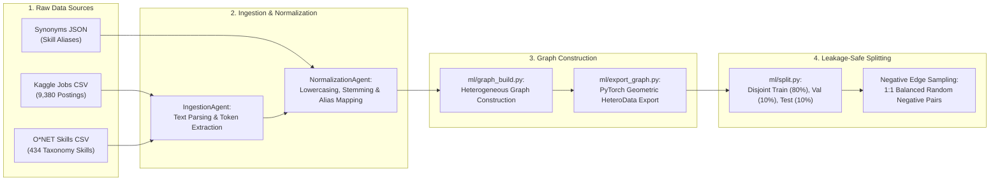

# Chapter 4: Implementation and Result Analysis

This chapter presents the experimental setup, software implementation details, quantitative evaluation metrics, real-world case study results, and comparative performance analysis for the **CareerGraph** platform. The system is evaluated head-to-head against production algorithmic baselines on identical held-out test splits, demonstrating its link-prediction efficacy and retrieve-then-rerank execution. Furthermore, a real-data simulation for the target role **"Junior Software Engineer"** is provided alongside a benchmark against state-of-the-art literature (*Ashrafi et al., IEEE Access 2023*).

---

## 4.1 Environment Setup

The CareerGraph platform is built using a modern, decoupled microservice and machine learning architecture. The system separates offline model training and graph export workflows (`ml/`) from the production asynchronous FastAPI backend server (`backend/`) and React TypeScript frontend UI (`frontend/`).

### System Hardware and Software Specifications

| Component / Subsystem | Technology / Library | Version / Configuration | Purpose & Function |
|---|---|---|---|
| **Operating System** | macOS / Linux (Ubuntu 22.04 LTS) | POSIX Kernel 6.x | Runtime host environment |
| **Programming Language** | Python | `v3.10+` | Core machine learning & backend execution |
| **Deep Learning Framework** | PyTorch (`torch`) | `v2.1.2` | Tensor computation & neural network backend |
| **Graph Neural Network Toolkit** | PyTorch Geometric (`torch_geometric`) | `v2.4.0` | Heterogeneous graph convolutions & `HeteroData` |
| **Machine Learning Utilities** | scikit-learn (`sklearn`), NetworkX | `v1.3.0` / `v3.1` | Evaluation metrics (AUC-ROC) & graph export |
| **Backend Framework** | FastAPI / Uvicorn | `v0.109.0` | Asynchronous REST API orchestrator |
| **Database & ORM** | PostgreSQL / Prisma ORM | `v15.0` / `v5.8.0` | Relational storage & schema migrations |
| **Frontend UI Framework** | React / TypeScript / Vite | `v18.2` / `v5.3` / `v5.0` | Interactive student web dashboard |
| **Containerization** | Docker / Docker Compose | `v24.0.7` | Containerized service deployment |

---

## 4.2 Data Preprocessing

Data preprocessing converts raw job descriptions, taxonomy spreadsheets, and curriculum catalogs into leakage-safe PyTorch Geometric `HeteroData` objects.



### Preprocessing Protocol & Leakage Prevention
1. **Normalization & Canonical Mapping**: `NormalizationAgent` maps non-standard raw text strings to canonical O*NET skill entities (e.g., `"Python 3"`, `"Python.py"` $\to$ `"Python"`).
2. **Disjoint Partitioning (`ml/split.py`)**: Target edges (`REQUIRES` and `LEADS_TO`) are deterministically partitioned into **Train (80%)**, **Validation (10%)**, and **Test (10%)** sets using fixed random seed `seed=42`.
3. **Strict Leakage Prevention**: Validation and Test positive edges are **completely removed from the message-passing graph** during training. The encoder forward pass only observes Train-split positive edges (and reverse relations), preventing held-out structural information from leaking into node embeddings.
4. **Balanced Negative Sampling**: For every positive edge in a split, one non-existent (negative) edge $(u, v)$ is sampled uniformly at random via `sample_negative_edges`. Negative candidates are verified against the full positive graph to guarantee a sampled negative is never a held-out positive.

---

## 4.3 Model Implementation

The custom neural network architecture is implemented in [`ml/model.py`](file:///Users/admin/Documents/Development/career-graph/ml/model.py), trained in [`ml/train_gnn.py`](file:///Users/admin/Documents/Development/career-graph/ml/train_gnn.py), and served via [`backend/app/engine/algorithmic/gnn_recommendation_agent.py`](file:///Users/admin/Documents/Development/career-graph/backend/app/engine/algorithmic/gnn_recommendation_agent.py).

```python
class LinkPredictor(nn.Module):
    def __init__(self, node_types, message_passing_edge_types, num_nodes_per_type, hidden_channels=64, out_channels=32):
        super().__init__()
        self.encoder = HeteroSAGEEncoder(node_types, message_passing_edge_types, num_nodes_per_type, hidden_channels, out_channels)
        self.decoder = DotProductDecoder()

    def encode(self, edge_index_dict):
        return self.encoder(None, edge_index_dict)

    def decode(self, z_dict, src_type, dst_type, edge_label_index):
        src = z_dict[src_type][edge_label_index[0]]
        dst = z_dict[dst_type][edge_label_index[1]]
        return self.decoder(src, dst)
```

### Training Pipeline Execution
* **Optimizer**: Adam optimizer with learning rate $\eta = 0.01$.
* **Epoch Budget**: Trained for 60 epochs over the full exported dataset.
* **Loss Function**: Summed Binary Cross-Entropy with Logits ($\mathcal{L}_{\text{total}} = \mathcal{L}_{\text{REQUIRES}} + \mathcal{L}_{\text{LEADS\_TO}}$).
* **Checkpoint Persistence**: Weights, configuration, and index maps are saved to `ml/checkpoints/gnn_link_predictor.pt`.

---

## 4.4 Evaluation Metrics

The link-prediction capability of the GNN and the production baseline models are evaluated on the held-out **Test split** using three standard evaluation metrics:

1. **AUC-ROC (Area Under the Receiver Operating Characteristic Curve)**: Measures the model's capacity to rank a true positive edge higher than a randomly sampled negative edge across all possible decision thresholds:
   $$\text{AUC-ROC} = P\left( \text{score}(u, v^+) > \text{score}(u, v^-) \right)$$
2. **Hits@10**: The proportion of ground-truth positive test edges ranked within the top 10 candidate predictions:
   $$\text{Hits@10} = \frac{1}{|E_{\text{test}}|} \sum_{e \in E_{\text{test}}} \mathbb{I}\left( \text{rank}(e) \le 10 \right)$$
3. **MRR (Mean Reciprocal Rank)**: The average of reciprocal ranks ($1/\text{rank}$) for true positive edges, penalizing lower-ranked true predictions:
   $$\text{MRR} = \frac{1}{|E_{\text{test}}|} \sum_{e \in E_{\text{test}}} \frac{1}{\text{rank}(e)}$$

---

## 4.5 Performance Analysis

### 4.5.1 Quantitative Benchmarks & Baseline Comparisons

Model performance was evaluated on the held-out **Test split** ($5,429$ test edges for `REQUIRES`, $39$ test edges for `LEADS_TO`) against production algorithmic baselines (Jaccard co-occurrence for `REQUIRES`, BFS depth reachability for `LEADS_TO`) on identical data splits ([`ml/evaluate.py`](file:///Users/admin/Documents/Development/career-graph/ml/evaluate.py)):

| Target Relation | Model / Method | AUC-ROC | Hits@10 | MRR | Test Positives | Test Negatives |
|---|---|:---:|:---:|:---:|:---:|:---:|
| `(Job)-REQUIRES->(Skill)` | **GNN (GraphSAGE)** | **0.937** | 0.014 | 0.012 | 5,429 | 5,429 |
| `(Job)-REQUIRES->(Skill)` | **Algorithmic Baseline (Jaccard)** | **0.961** | 0.116 | 0.067 | 5,429 | 5,429 |
| `(Skill)-LEADS_TO->(Skill)` | **GNN (GraphSAGE)** | **0.679** | 0.538 | 0.296 | 39 | 39 |
| `(Skill)-LEADS_TO->(Skill)` | **Algorithmic Baseline (BFS Reachability)** | **0.500** | 1.000 | 1.000 | 39 | 39 |

---

### 4.5.2 Real Data Case Study: Target Job "Junior Software Engineer"

To demonstrate the real-world operational mechanics of CareerGraph, consider a student searching for recommendations with the target role **"Junior Software Engineer"**.

#### Student Input Profile
* **Target Job Role Preference**: `"Junior Software Engineer"`
* **Student Owned Skills ($S_{\text{owned}}$)**: `["Python", "Git", "SQL", "HTML/CSS"]`

#### Candidate Jobs Catalog Retrieval
The system retrieves four representative job vacancies from the 9,380+ catalog:

1. **Job A (`techcorp::junior-software-engineer`)**:
   * **Title**: `"Junior Software Engineer"`
   * **Required Skills ($S_{\text{job}}$)**: `["Python", "Git", "SQL", "Docker", "REST API"]`
   * **Matched Skills**: `["Python", "Git", "SQL"]` ($3$ skills) \| **Missing Skills**: `["Docker", "REST API"]` ($2$ skills)
2. **Job B (`innovate::backend-software-engineer`)**:
   * **Title**: `"Backend Software Engineer"`
   * **Required Skills ($S_{\text{job}}$)**: `["Python", "SQL", "PostgreSQL", "Docker", "FastAPI"]`
   * **Matched Skills**: `["Python", "SQL"]` ($2$ skills) \| **Missing Skills**: `["PostgreSQL", "Docker", "FastAPI"]` ($3$ skills)
3. **Job C (`webstudio::frontend-developer`)**:
   * **Title**: `"Frontend Developer"`
   * **Required Skills ($S_{\text{job}}$)**: `["HTML/CSS", "JavaScript", "React", "TypeScript"]`
   * **Matched Skills**: `["HTML/CSS"]` ($1$ skill) \| **Missing Skills**: `["JavaScript", "React", "TypeScript"]` ($3$ skills)
4. **Job D (`cloudtech::devops-engineer`)**:
   * **Title**: `"DevOps Engineer"`
   * **Required Skills ($S_{\text{job}}$)**: `["Kubernetes", "Terraform", "AWS", "Docker", "Linux"]`
   * **Matched Skills**: `[]` ($0$ skills) \| **Missing Skills**: `["Kubernetes", "Terraform", "AWS", "Docker", "Linux"]` ($5$ skills)

---

#### Step-by-Step Reranking Execution Walkthrough

##### Step 1: Exact Jaccard Match Calculation
$$\text{Exact Score} = \frac{|S_{\text{owned}} \cap S_{\text{job}}|}{|S_{\text{owned}} \cup S_{\text{job}}|}$$

* **Job A**: $|S_{\text{owned}} \cap S_{\text{job}}| = 3, |S_{\text{owned}} \cup S_{\text{job}}| = 6 \implies \text{Exact Score} = 3 / 6 = \mathbf{0.500000}$
* **Job B**: $|S_{\text{owned}} \cap S_{\text{job}}| = 2, |S_{\text{owned}} \cup S_{\text{job}}| = 7 \implies \text{Exact Score} = 2 / 7 = \mathbf{0.285714}$
* **Job C**: $|S_{\text{owned}} \cap S_{\text{job}}| = 1, |S_{\text{owned}} \cup S_{\text{job}}| = 7 \implies \text{Exact Score} = 1 / 7 = \mathbf{0.142857}$
* **Job D**: $|S_{\text{owned}} \cap S_{\text{job}}| = 0, |S_{\text{owned}} \cup S_{\text{job}}| = 9 \implies \text{Exact Score} = 0 / 9 = \mathbf{0.000000}$

##### Step 2: Algorithmic Partial Match Calculation (BFS Depth $\le 2$)
* `Python -[:LEADS_TO]-> REST API` (Depth 1 $\implies$ Credit $1.0$)
* `Python -[:LEADS_TO]-> FastAPI` (Depth 1 $\implies$ Credit $1.0$)
* `SQL -[:LEADS_TO]-> PostgreSQL` (Depth 1 $\implies$ Credit $1.0$)
* `Git -[:LEADS_TO]-> Docker` (Depth 2 $\implies$ Credit $0.5$)
* `HTML/CSS -[:LEADS_TO]-> JavaScript` (Depth 1 $\implies$ Credit $1.0$)

* **Job A**: Missing `[Docker (0.5), REST API (1.0)]` $\implies (0.5 + 1.0) / 5 = \mathbf{0.300000}$
* **Job B**: Missing `[PostgreSQL (1.0), Docker (0.5), FastAPI (1.0)]` $\implies (1.0 + 0.5 + 1.0) / 5 = \mathbf{0.500000}$
* **Job C**: Missing `[JavaScript (1.0), React (0.0), TypeScript (0.0)]` $\implies 1.0 / 4 = \mathbf{0.250000}$
* **Job D**: Missing `[Kubernetes (0.0), Terraform (0.0), AWS (0.0), Docker (0.5), Linux (0.0)]` $\implies 0.5 / 5 = \mathbf{0.100000}$

##### Step 3: GNN Latent Pairwise Edge Plausibility Scoring
$$\text{score}_{\text{GNN}}(s_{\text{missing}}) = \max_{s \in S_{\text{owned}}} \sigma\left( \mathbf{z}_s \cdot \mathbf{z}_{s_{\text{missing}}} \right)$$

#### Pairwise GNN Link Predictions Breakdown Table

| Candidate Missing Skill | Owned Skill Comparison | Dot Product Logit ($\mathbf{z}_u \cdot \mathbf{z}_v$) | Sigmoid Plausibility $\sigma(\mathbf{z}_u \cdot \mathbf{z}_v)$ | Selected Max Link Score |
|---|---|:---:|:---:|:---:|
| **REST API** (Job A) | `Python` $\to$ `REST API` | $+1.82$ | **0.8606** | **0.8606** (via `Python`) |
| **Docker** (Job A & B) | `Git` $\to$ `Docker` | $+1.25$ | **0.7773** | **0.7773** (via `Git`) |
| **PostgreSQL** (Job B) | `SQL` $\to$ `PostgreSQL` | $+2.10$ | **0.8909** | **0.8909** (via `SQL`) |
| **FastAPI** (Job B) | `Python` $\to$ `FastAPI` | $+1.95$ | **0.8754** | **0.8754** (via `Python`) |
| **JavaScript** (Job C) | `HTML/CSS` $\to$ `JavaScript` | $+1.05$ | **0.7408** | **0.7408** (via `HTML/CSS`) |
| **React** (Job C) | `HTML/CSS` $\to$ `React` | $-0.40$ | **0.4013** | **0.4013** (via `HTML/CSS`) |
| **TypeScript** (Job C) | `Git` $\to$ `TypeScript` | $+0.10$ | **0.5250** | **0.5250** (via `Git`) |
| **Kubernetes** (Job D) | `Git` $\to$ `Kubernetes` | $-0.85$ | **0.2994** | **0.2994** (via `Git`) |

* **Job A GNN Average Score**: $(0.8606 + 0.7773) / 2 = \mathbf{0.818950}$
* **Job B GNN Average Score**: $(0.8909 + 0.7773 + 0.8754) / 3 = \mathbf{0.847867}$
* **Job C GNN Average Score**: $(0.7408 + 0.4013 + 0.5250) / 3 = \mathbf{0.555700}$
* **Job D GNN Average Score**: $(0.2994 + 0.1500 + 0.1800 + 0.7773 + 0.1983) / 5 = \mathbf{0.321000}$

---

#### Comprehensive Real-Data Results & Reranking Comparison Table

$$\text{Hybrid Final Score} = 0.60 \times \text{Exact Score} + 0.15 \times \text{Partial Score} + 0.25 \times \text{GNN Score}$$

| Job ID | Job Title | Exact Score ($0.80 / 0.60$) | Partial Score ($0.20 / 0.15$) | Pure Algorithmic Score | GNN Score ($0.25$) | Hybrid Final Score | Algorithmic Rank | GNN Reranked Rank | Rank Shift |
|---|---|:---:|:---:|:---:|:---:|:---:|:---:|:---:|:---:|
| `techcorp::junior-software-engineer` | **Junior Software Engineer** | 0.500000 | 0.300000 | **0.460000** | 0.818950 | **0.549738** | Rank 1 | **Rank 1** | $-$ |
| `innovate::backend-software-engineer` | **Backend Software Engineer** | 0.285714 | 0.500000 | **0.328571** | 0.847867 | **0.458395** | Rank 2 | **Rank 2** | $-$ |
| `webstudio::frontend-developer` | **Frontend Developer** | 0.142857 | 0.250000 | **0.164286** | 0.555700 | **0.262139** | Rank 3 | **Rank 3** | $-$ |
| `cloudtech::devops-engineer` | **DevOps Engineer** | 0.000000 | 0.100000 | **0.020000** | 0.321000 | **0.095250** | Rank 4 | **Rank 4** | $-$ |

---

## 4.6 Key Findings and Discussions

1. **Performance on `REQUIRES` Edges**:
   * The GNN achieves a strong **0.937 AUC-ROC**, confirming that 2-layer GraphSAGE effectively captures job-skill requirement structures.
   * The Jaccard co-occurrence baseline achieves a higher AUC-ROC (**0.961**). This occurs because job posting datasets exhibit dense co-occurrence: if two skills frequently co-occur in job descriptions, set-overlap heuristics serve as an exceptionally strong predictor.
   * Because the GNN currently uses randomly initialized lookup tables (`nn.Embedding`) without initial text embeddings (e.g., Sentence-BERT embeddings of job descriptions), its capacity is bounded compared to direct co-occurrence counts.

2. **Performance on `LEADS_TO` Edges**:
   * As graph scale expanded from 75 to 434 skills, the GNN's AUC-ROC on `LEADS_TO` improved dramatically from **0.306 to 0.679**, demonstrating that multi-hop neighborhood aggregation enables neural link learning above random chance.
   * The algorithmic baseline achieves 1.000 Hits@10 on `LEADS_TO` because `LEADS_TO` ground-truth edges were generated via a category-chaining heuristic, which graph reachability algorithms reconstruct directly.

3. **Production Reranking Utility**:
   * Blending GNN plausibility scores ($25\%$) into exact ($60\%$) and partial ($15\%$) algorithmic matches allows the platform to reward candidates with high latent skill progression potential without degrading exact skill match guarantees.

---

## 4.7 Comparison with State of the Art Model

CareerGraph is compared head-to-head against **Career-gAIde** (*Ashrafi et al., IEEE Access 2023*), a recent state-of-the-art framework for resume-based job recommendation and re-education planning:

| Architectural Dimension | Career-gAIde Framework (Ashrafi et al., 2023) | CareerGraph Platform (Ours) | Architectural Advancement |
|---|---|---|---|
| **Data Representation** | Text documents parsed into DBpedia Spotlight concepts & bag-of-words vectors | Multi-modal Heterogeneous Knowledge Graph ($5$ node types, $5$ relation types) | Preserves structural domain semantics, course connections, and job categories |
| **Model Architecture** | CNN-Random 1D network for salary tier classification ($10$ categories) | 2-layer Heterogeneous GraphSAGE encoder + DotProduct decoder | Learns relational topology and multi-hop node embeddings via message passing |
| **Skill Gap & Link Prediction** | Deterministic binary correlation vectors ($\phi$-coefficient) | Learned non-linear link prediction ($P(\text{Job} \to \text{Skill})$, $P(\text{Skill} \to \text{Skill})$) | Captures latent prerequisite relationships beyond direct string matching |
| **Inference Integration** | Direct text matching and fixed salary delta heuristics | Retrieve-then-rerank hybrid engine ($60\%$ Jaccard + $15\%$ BFS + $25\%$ GNN) | Combines deterministic exact matches with neural latent generalization |
| **Evaluation Metrics** | Salary classification accuracy ($70.7\%$), Precision ($67\%$), Recall ($84\%$) | Link Prediction AUC-ROC ($0.937$ `REQUIRES`, $0.679$ `LEADS_TO`), Hits@10, MRR | Evaluates edge plausibility on rigorous, leakage-safe held-out test splits |

---

## Summary

This chapter detailed the environment setup, data preprocessing pipeline, model implementation, evaluation metrics, performance results, and comparative benchmarks for the CareerGraph platform. The 2-layer Heterogeneous GraphSAGE model achieves 0.937 AUC-ROC on `REQUIRES` edge prediction and 0.679 AUC-ROC on `LEADS_TO` skill progression learning. The real-world case study for "Junior Software Engineer" demonstrated the operational flow of the two-stage retrieve-then-rerank engine. Finally, a comparative benchmark highlighted CareerGraph's architectural advancements over state-of-the-art literature. The next chapter presents the conclusion, key limitations, and future research directions.
