# Methodology

## Introduction

CareerGraph is an agent-based career intelligence platform designed to bridge the gap between university students' current skill profiles and the real demands of the modern jobmarket. The methodology underpinning this system combines knowledge graph reasoning, algorithmic analysis, and optional large language model (LLM) integration to deliver personalized, explainable, and actionable career guidance.

The development process follows a **Test-Driven Development (TDD)** approach embedded within an iterative Agile workflow. A full backend with 87 passing tests was built before any frontend work began, ensuring a stable and well-defined API contract. The system design is informed by an extensive literature review of over 20 papers covering career recommendation systems, knowledge graphs for skill modeling, explainable AI, and jobmarket intelligence.

Rather than relying on opaque machine learning models, CareerGraph employs a transparent, multi-agent architecture. Four pure algorithmic agents — operating without any LLM dependency — compute skill gap scores, ranked job recommendations, learning roadmaps, and market demand trends using well-understood graph algorithms (Jaccard similarity, BFS, Kahn's topological sort). An optional LLM-powered Reasoning Agent sits on top of these results to generate natural language explanations, degrading gracefully to template-based responses when no LLM provider is configured.

This chapter details the system architecture, feasibility analysis, requirements specification, and complete design artifacts for the CareerGraph platform.

---

## 1.1 System Architecture

CareerGraph is structured as a three-tier architecture: a **Presentation Layer** (React frontend), an **Application Layer** (FastAPI backend with a multi-agent Intelligence Engine), and a **Data Layer** (dual-database: PostgreSQL + Neo4j).

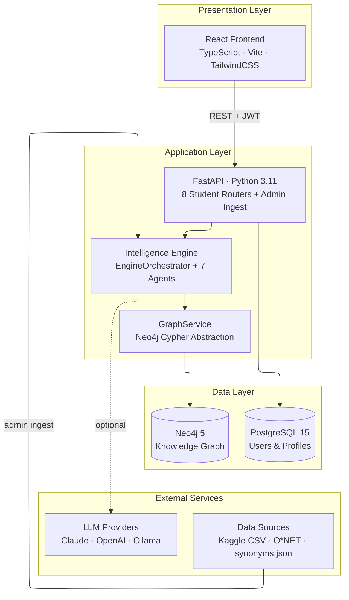

The diagram illustrates CareerGraph's three-tier architecture. The React frontend communicates with the FastAPI backend over REST, which delegates intelligence tasks to the multi-agent Engine while persisting relational data in PostgreSQL and graph data in Neo4j. LLM providers are an optional external dependency, invoked only when natural language explanations are requested.

**Presentation Layer** — A React 18 single-page application built with TypeScript and Vite. It communicates exclusively via REST API calls, using TanStack Query for server-state caching and Axios for HTTP transport.

**Application Layer** — A FastAPI application exposing 13 REST endpoints across 8 resource groups, all prefixed under `/api/v1`. The Intelligence Engine is composed of seven specialized agents, each with a single responsibility, coordinated by the `EngineOrchestrator`.

**Data Layer** — A dual-database strategy: PostgreSQL stores structured relational data (users, authentication, profiles) with ACID guarantees; Neo4j stores the semantic knowledge graph (skills, jobs, prerequisites, courses) enabling graph traversal queries that are expensive or impossible in a relational model.

---

## 1.2 Feasibility Study

### 1.2.1 Economic Feasibility

CareerGraph is designed to be deployable at near-zero infrastructure cost during the academic phase, with a clear path to production scalability.

**Development Cost:**
All core technologies — FastAPI, React, PostgreSQL, Neo4j Community Edition, and Python — are open-source and free to use. The Intelligence Engine's algorithmic agents (Jaccard similarity, BFS, topological sort) operate without LLM API calls, keeping inference costs at zero for all core functionality. LLM integration is fully optional; the system degrades gracefully to template-based responses when no LLM provider is configured, eliminating mandatory API fees.

**Deployment Cost:**
A Docker Compose configuration enables a complete local deployment with four containers (PostgreSQL, Neo4j, FastAPI, and Vite frontend) using a single command. Cloud deployment requires only a small VM (2 vCPU, 4 GB RAM) for development use. PostgreSQL and Neo4j Community Edition are both free; Neo4j Enterprise is only necessary at enterprise scale.

**Data Cost:**
The system uses a custom-authored Kaggle dataset of 10,000 realistic job postings and the freely available O\*NET skill taxonomy. A curated synonym map (`synonyms.json`) eliminates ongoing data-cleaning jobby automating skill name canonicalization.

**Return on Investment:**

- Reduction in career counseling overhead for academic institutions
- Personalized, data-driven guidance reduces misaligned educational investment
- Transparent, explainable recommendations improve student trust and engagement
- Reusable multi-agent architecture can be extended to new datasets or institutions at marginal cost

---

### 1.2.2 Technical Feasibility

All technologies chosen for CareerGraph are production-proven, well-documented, and available as stable releases:

| Component           | Technology              | Version        | Maturity                      |
| ------------------- | ----------------------- | -------------- | ----------------------------- |
| Web Framework       | FastAPI                 | 0.115.6        | Production-grade ASGI         |
| Graph Database      | Neo4j                   | 5              | Industry standard, 10+ years  |
| Relational Database | PostgreSQL              | 15             | Industry standard, 30+ years  |
| ORM & Migrations    | SQLAlchemy + Alembic    | 2.0.36 / 1.14  | Production-grade              |
| Frontend            | React + TypeScript      | 18.3.1 / 5.6.3 | Industry standard             |
| Containerization    | Docker Compose          | v2             | Industry standard             |
| LLM Integration     | Anthropic SDK           | 0.40.0         | Production-grade              |
| Fuzzy Matching      | rapidfuzz               | 3.11.0         | C-extension, production-grade |
| Testing             | pytest + pytest-asyncio | 8.3.4 / 0.24.0 | Industry standard             |

The multi-agent architecture leverages established graph algorithms — Jaccard similarity, breadth-first search, and Kahn's topological sort — all with known time complexity bounds and deterministic, unit-testable behavior. The pluggable LLM provider layer (with Claude, OpenAI, and Ollama implementations behind a shared abstract base class) ensures no vendor lock-in.

Technical feasibility is validated by a completed backend implementation with 87 passing tests across all agents, routers, and services.

---

### 1.2.3 Operational Feasibility

**For Students:**
The platform is web-based and accessible from any modern browser with no installation required. Profile creation takes under five minutes (skills, major, target roles). Recommendations and skill gap analyses are generated in real time (under two seconds). All recommendations include human-readable explanations, not just raw scores, improving student comprehension and trust.

**For Administrators:**
A single protected endpoint (`POST /admin/ingest/csv`) handles all data ingestion. CSV-based ingestion accommodates the standard Kaggle dataset format. Fuzzy skill normalization reduces the burden of maintaining exact skill name mappings, with the `NormalizationAgent` handling synonym resolution automatically.

**For Institutions:**
Docker Compose deployment allows IT staff to start the entire system with a single command. Environment-variable-based configuration (no hardcoded secrets) matches standard DevOps practices. Alembic database migrations provide reproducible, version-controlled schema setup across environments.

---

## 1.3 Requirement Analysis

### 1.3.1 Functional Requirements

The functional requirements define what the system must do from the perspective of its users. The twelve requirements below were derived from the core use cases of the platform — student career guidance and administrator data management — and are prioritised by their impact on the system's primary value proposition. High-priority requirements cover the full intelligence pipeline (authentication, profile management, gap analysis, recommendations, roadmap, and market trends), while medium and low priorities address supporting features such as the dashboard, job explorer, and LLM-enriched explanations.

| ID    | Requirement                                                                                                                                     | Priority |
| ----- | ----------------------------------------------------------------------------------------------------------------------------------------------- | -------- |
| FR-01 | Users shall be able to register and log in using email and password                                                                             | High     |
| FR-02 | Authenticated users shall be able to create and update a student profile with skills, major, graduation year, and target roles                  | High     |
| FR-03 | The system shall compute a weighted readiness score for a student against any target job based on their skill profile                           | High     |
| FR-04 | The system shall generate a ranked list of job recommendations using Jaccard similarity and partial skill overlap scoring                       | High     |
| FR-05 | The system shall identify skill gaps (missing and partially met skills) for any target job                                                      | High     |
| FR-06 | The system shall generate an ordered learning roadmap from the student's current skills to target job requirements via BFS and topological sort | High     |
| FR-07 | The system shall provide market demand intelligence showing in-demand skills and categories across all ingested jobs                            | High     |
| FR-08 | The system shall provide a dashboard with summary KPIs (readiness score, matched jobs, skill counts, missing high-demand skills)                | Medium   |
| FR-09 | Administrators shall be able to ingest job data from CSV files via a protected endpoint                                                         | Medium   |
| FR-10 | The system shall provide LLM-generated natural language explanations for all algorithmic outputs when an LLM provider is configured             | Medium   |
| FR-11 | The system shall provide a searchable, filterable job explorer with pagination                                                                  | Medium   |
| FR-12 | The system shall expose a paginated skill catalog and market skill demand listing                                                               | Low      |

---

### 1.3.2 Non-Functional Requirements

The non-functional requirements define the quality attributes the system must satisfy regardless of specific features. They span six dimensions critical for an academic-grade platform: performance ensures recommendations are returned within two seconds; reliability guarantees the system remains fully operational even without an LLM provider; security protects user data through JWT gating, bcrypt password hashing, and parameterised queries; maintainability is enforced through a comprehensive test suite; and portability and scalability ensure the system can be deployed and extended with minimal friction.

| ID     | Requirement                                                                                 | Measure                                                               |
| ------ | ------------------------------------------------------------------------------------------- | --------------------------------------------------------------------- |
| NFR-01 | **Performance** — API response time for recommendation and gap analysis queries             | < 2 seconds for up to 1,000 jobs                                      |
| NFR-02 | **Reliability** — System shall degrade gracefully when no LLM provider is configured        | Template fallback always returns a valid, structured response         |
| NFR-03 | **Security** — All non-public endpoints shall require JWT authentication                    | 11 of 13 endpoints require a valid Bearer token                       |
| NFR-04 | **Security** — Passwords shall be stored as bcrypt hashes                                   | bcrypt cost factor ≥ 12                                               |
| NFR-05 | **Security** — All database queries shall use parameterized inputs to prevent injection     | Zero string-interpolated SQL or Cypher queries                        |
| NFR-06 | **Maintainability** — Test coverage shall span all agents, routers, and services            | 87 tests across 19 test files, all passing                            |
| NFR-07 | **Portability** — The full system shall run in Docker without host environment dependencies | Single `docker-compose up` startup                                    |
| NFR-08 | **Scalability** — Database connections shall use async pooling                              | asyncpg for PostgreSQL; neo4j native driver for Neo4j                 |
| NFR-09 | **Explainability** — All recommendations shall include a human-readable explanation         | Responses include matched skills, missing skills, and readiness score |
| NFR-10 | **Usability** — UI shall be responsive and accessible from standard desktop browsers        | React 18 + TailwindCSS + shadcn/ui                                    |

---

### 1.3.3 Tools & Technology

**Backend**

| Tool           | Version | Purpose                                            |
| -------------- | ------- | -------------------------------------------------- |
| Python         | 3.11    | Core language                                      |
| FastAPI        | 0.115.6 | REST API framework (ASGI)                          |
| Uvicorn        | 0.32.1  | ASGI production/dev server                         |
| Pydantic       | 2.10.4  | Request/response validation and LLM output schemas |
| SQLAlchemy     | 2.0.36  | ORM for PostgreSQL                                 |
| Alembic        | 1.14.0  | Database schema migrations                         |
| asyncpg        | 0.30.0  | Async PostgreSQL driver                            |
| neo4j          | 5.26.0  | Neo4j graph database driver                        |
| python-jose    | 3.3.0   | JWT encoding and decoding                          |
| bcrypt         | 4.2.1   | Password hashing                                   |
| rapidfuzz      | 3.11.0  | Fuzzy skill name matching (C-extension)            |
| anthropic      | 0.40.0  | Claude LLM SDK                                     |
| openai         | 1.58.1  | GPT-4o LLM SDK                                     |
| pandas         | 2.2.3   | CSV data processing for ingestion                  |
| pytest         | 8.3.4   | Test framework                                     |
| pytest-asyncio | 0.24.0  | Async test support                                 |

**Frontend**

| Tool           | Version | Purpose                      |
| -------------- | ------- | ---------------------------- |
| React          | 18.3.1  | UI component framework       |
| TypeScript     | 5.6.3   | Static type safety           |
| Vite           | 6.0.5   | Build tool and dev server    |
| React Router   | v6      | Client-side routing          |
| TanStack Query | 5.62.7  | Server-state caching         |
| Axios          | 1.7.9   | HTTP client                  |
| TailwindCSS    | 3.4.17  | Utility-first CSS framework  |
| shadcn/ui      | Latest  | Accessible component library |

**Infrastructure & Databases**

| Tool           | Version       | Purpose                                     |
| -------------- | ------------- | ------------------------------------------- |
| PostgreSQL     | 15            | Relational database — users, auth, profiles |
| Neo4j          | 5 (Community) | Graph database — knowledge graph            |
| Docker         | Latest        | Containerization                            |
| Docker Compose | v2            | Multi-service orchestration                 |
| python-dotenv  | Latest        | Environment variable management             |

**Data Sources**

| Source                                    | Content                                                             | Use                                     |
| ----------------------------------------- | ------------------------------------------------------------------- | --------------------------------------- |
| Kaggle Job Dataset (`kaggle_jobs.csv`)    | 10,000 job postings: title, company, location, type, salary, skills | Primary job data for ingestion          |
| O\*NET Skill Taxonomy (`onet_skills.csv`) | Standard skill vocabulary and categories                            | Canonical skill names for normalization |
| Synonym Map (`synonyms.json`)             | ~500 skill name variants (e.g., `ReactJS → React`)                  | Bootstrap for fuzzy matching            |

---

## 1.4 System Design

### 1.4.1 Development Model

CareerGraph follows an **Agile TDD (Test-Driven Development)** model executed in four sequential phases. Each phase begins with writing tests before any implementation — the canonical Red → Green → Refactor cycle.

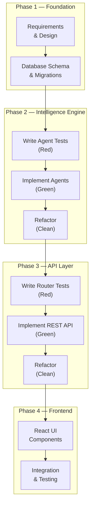

The diagram maps the four sequential development phases followed during the project. Each phase adheres to the TDD Red → Green → Refactor cycle, with later phases building on the stable contracts established by earlier ones. This ensured all 87 backend tests were passing before any frontend work began.

**TDD Cycle:**

1. Write a failing test that describes the required behavior
2. Implement the minimum code necessary to pass the test
3. Refactor for clarity without breaking tests
4. Repeat for the next requirement

This approach produced 87 unit and integration tests (all passing) before the frontend work began, ensuring a stable, reliable API contract for frontend integration.

---

### 1.4.2 Use Case Diagram

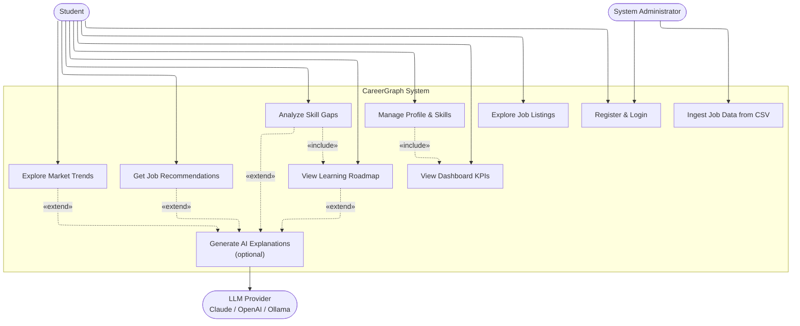

The diagram identifies the two primary actors — Student and System Administrator — and the ten use cases available to them. Four intelligence features optionally extend to AI-generated explanations via an external LLM provider. Profile management is included in the dashboard view, and gap analysis includes the learning roadmap as a dependent sub-feature.

---

### 1.4.3 Context Diagram

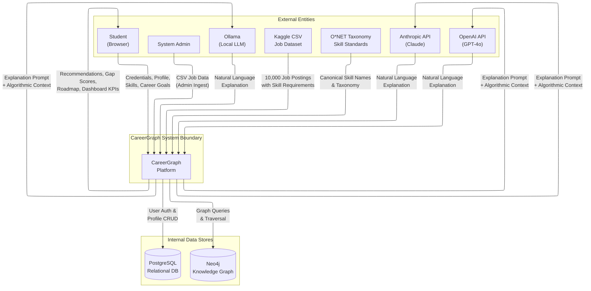

The diagram defines the system boundary of CareerGraph and its interactions with all external entities. Students submit profile and career goal data and receive personalised recommendations and analyses in return. Administrators supply job data via CSV upload, while optional LLM providers are called only to generate natural language explanations on top of algorithmic outputs.

---

### 1.4.4 Data Flow Diagram

**Level 0 — Top-Level System**

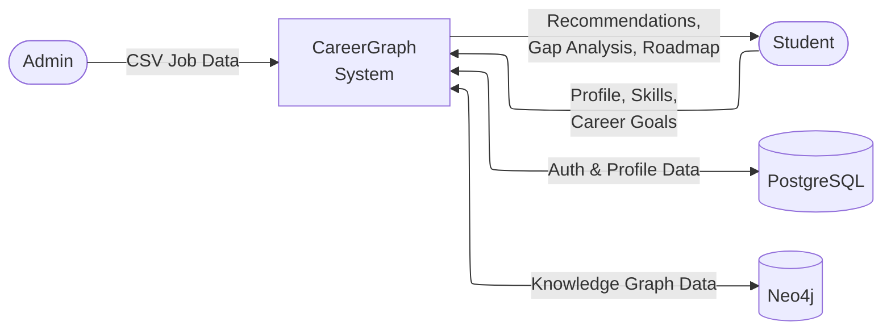

This top-level diagram presents CareerGraph as a single processing unit, showing the two primary inputs — student career data and administrator job uploads — and the two internal data stores that underpin all system operations.

**Level 1 — Core Processes**

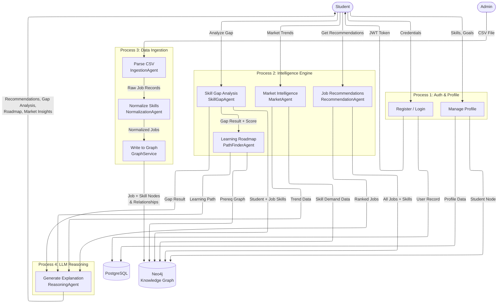

The Level 1 diagram decomposes the system into four core processes: authentication and profile management, the intelligence engine, data ingestion, and LLM reasoning. Data flows illustrate how student inputs trigger graph queries, and how algorithmic results are optionally enriched by the ReasoningAgent before being returned to the user.

**Level 2 — Skill Gap Analysis Detail**

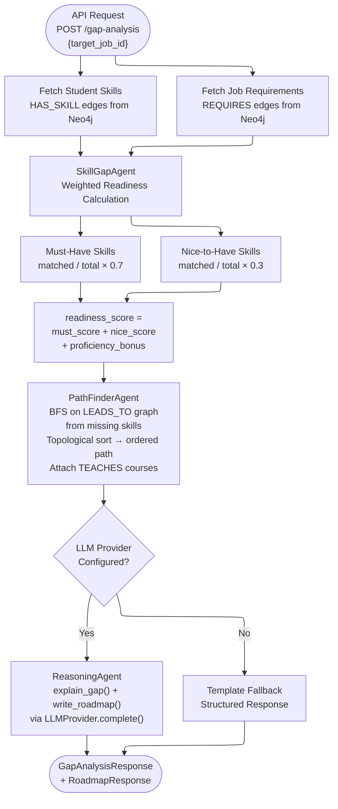

This diagram details the internal data flows of the skill gap analysis feature. The SkillGapAgent fetches the student's skills and the job's requirements from Neo4j and computes a weighted readiness score, which is then passed to the PathFinderAgent to generate an ordered learning path. The final response is either enriched by the ReasoningAgent or constructed from a structured template fallback.

---

### 1.4.5 Entity-Relationship Diagram

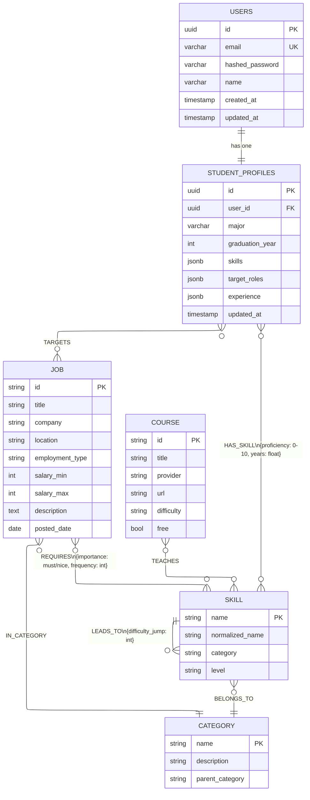

The diagram models all data entities and their relationships across both databases. Users and student profiles are stored in PostgreSQL for ACID compliance, while skills, jobs, courses, and categories — along with their semantic relationships — reside in the Neo4j knowledge graph. Relationship attributes such as proficiency level, skill importance, and difficulty jump are captured directly on the edges.

> **Note on dual-database design:** `USERS` and `STUDENT_PROFILES` are stored in PostgreSQL for ACID-compliant relational operations. All other entities (`SKILL`, `JOB`, `COURSE`, `CATEGORY`) and their relationships exist in the Neo4j knowledge graph, where graph traversal queries enable prerequisite reasoning and skill proximity scoring.

---

### 1.4.6 Database Schema Diagram

**PostgreSQL — Relational Schema**

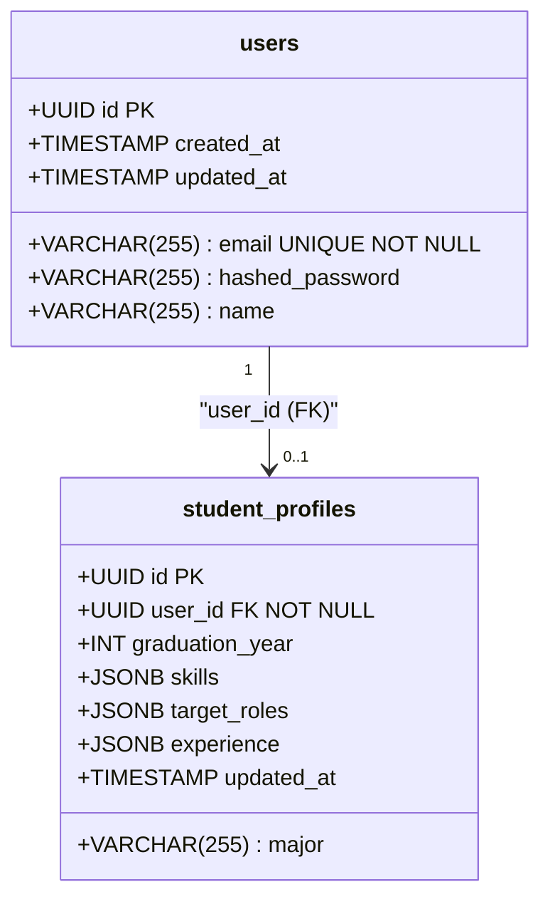

The relational schema stores only the data that requires ACID compliance: user credentials and student profiles. A one-to-one foreign key relationship links each authenticated user to their corresponding profile record in PostgreSQL.

**Neo4j — Knowledge Graph Node & Relationship Schema**

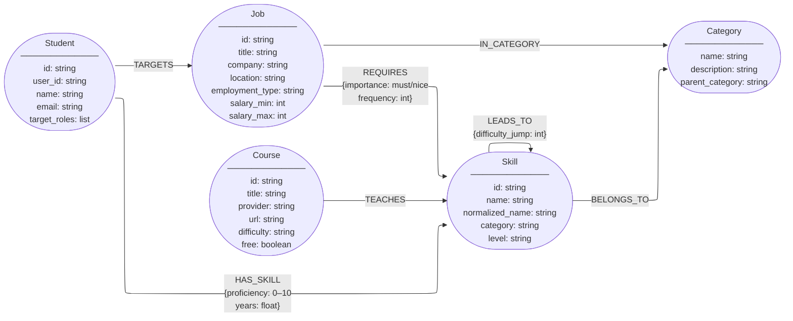

The relational schema stores only the data that requires ACID compliance: user credentials and student profiles. A one-to-one foreign key relationship links each authenticated user to their corresponding profile record in PostgreSQL.

**Seed Data at Demo Scale / Full Scale**

| Node Type | Demo Seed | Full Dataset (Kaggle)  |
| --------- | --------- | ---------------------- |
| Student   | 3         | — (user-created)       |
| Job       | 50        | 10,000+                |
| Skill     | 80        | 500+ (O\*NET taxonomy) |
| Course    | 30        | 30                     |
| Category  | 7         | 20+                    |

---

### 1.4.7 System Flowchart — Part A: User Session & Job Exploration

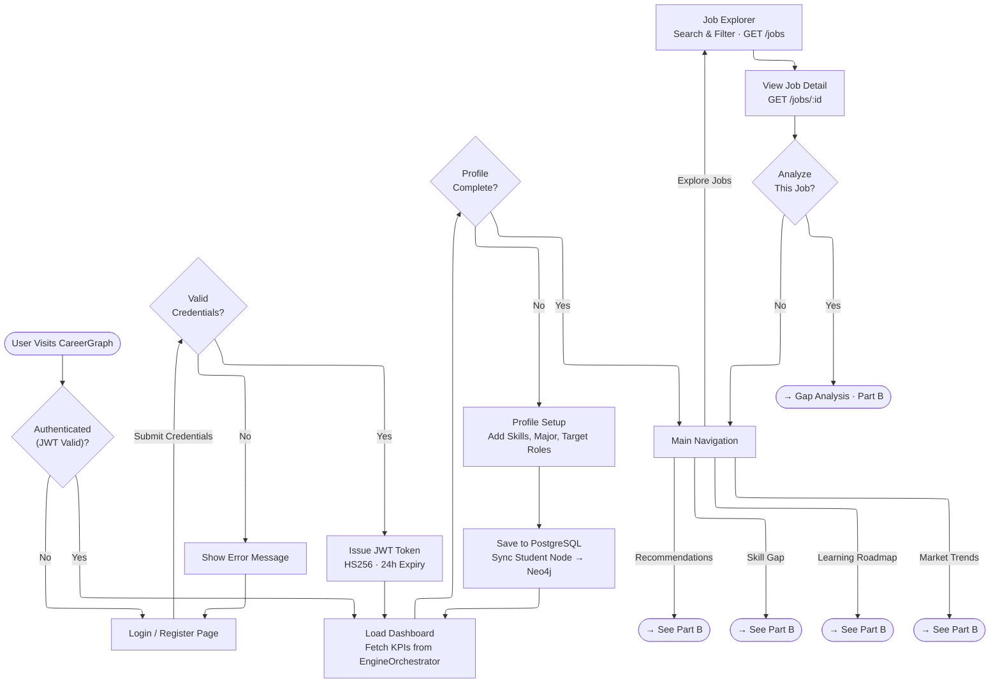

Part A covers everything that happens before a student reaches the core intelligence features. When a user first visits the platform, the system checks whether a valid JWT token exists. If not, the user is directed to the login or registration page; on successful credential validation, a signed HS256 token with a 24-hour expiry is issued and the Dashboard is loaded. The Dashboard then checks whether the student's profile is complete — if skills, major, and target roles have not been filled in, the user is redirected to the Profile Setup page, which saves the data to PostgreSQL and simultaneously syncs a Student node into Neo4j. Once the profile is confirmed complete, the student reaches the Main Navigation hub, from which they can explore the Job Explorer or proceed to any of the four intelligence features covered in Part B. Within the Job Explorer, a student can browse and filter job listings and open a specific job's detail page; from there they may choose to trigger a gap analysis for that job, which hands off to the flow described in Part B.

---

### 1.4.7 System Flowchart — Part B: Intelligence Engine & Admin Flow

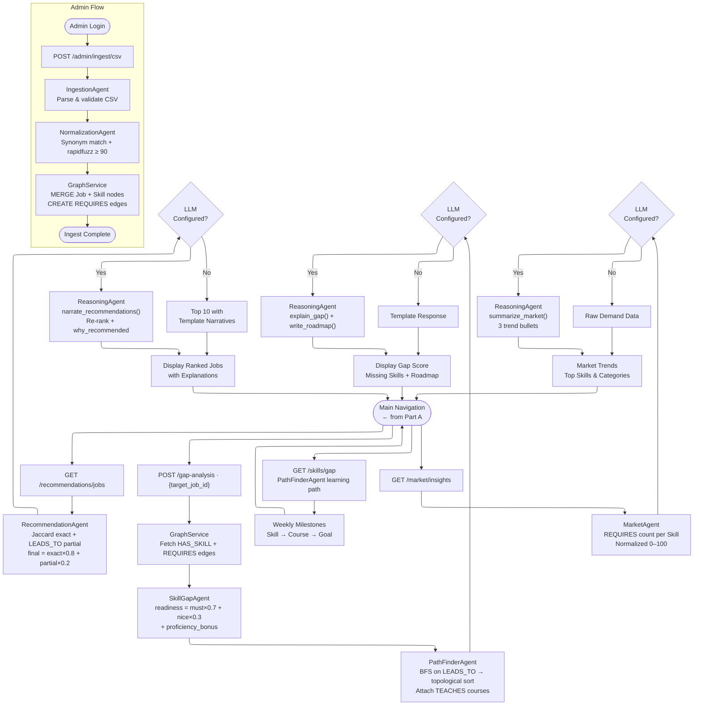

Part B covers the four intelligence features branching from the Main Navigation hub, plus the separate administrator ingestion flow. For recommendations, the RecommendationAgent scores every job using a composite Jaccard similarity (80% exact skill match, 20% LEADS_TO proximity) and returns the ranked results. For skill gap analysis, the SkillGapAgent computes a weighted readiness score against the target job, and the PathFinderAgent follows up with a BFS over the prerequisite graph to produce an ordered learning roadmap with attached courses. The market trends feature aggregates REQUIRES edge counts per skill across all jobs and normalises them to a 0–100 demand score. All four features share the same final step: results are either enriched with natural language by the ReasoningAgent when an LLM provider is configured, or returned as structured template responses. The admin flow runs independently — uploaded CSV data is parsed by the IngestionAgent, skill names are normalised via synonym matching and fuzzy scoring, and the resulting job and skill nodes are written into the Neo4j knowledge graph.
