# CareerGraph — System Design Document
### Agent-Based Labor Market Intelligence Platform for Student Career Guidance

> **Version:** 3.0 | **Date:** April 2026
> **Stack:** React · FastAPI · Neo4j · PostgreSQL · Multi-Agent Intelligence Engine · Pluggable LLM

---

## Table of Contents

1. [Executive Summary](#1-executive-summary)
2. [Project Scope](#2-project-scope)
3. [System Architecture Overview](#3-system-architecture-overview)
4. [Technology Stack](#4-technology-stack)
5. [Frontend Architecture](#5-frontend-architecture)
6. [Backend Architecture](#6-backend-architecture)
7. [Database Design](#7-database-design)
   - 7.1 [PostgreSQL — Relational Schema](#71-postgresql--relational-schema)
   - 7.2 [Neo4j — Knowledge Graph Schema](#72-neo4j--knowledge-graph-schema)
8. [API Contract](#8-api-contract)
9. [Intelligence Engine — Agent Architecture](#9-intelligence-engine--agent-architecture)
   - 9.1 [Agent Overview](#91-agent-overview)
   - 9.2 [Ingestion Pipeline](#92-ingestion-pipeline)
   - 9.3 [Algorithmic Agents](#93-algorithmic-agents)
   - 9.4 [LLM Provider Abstraction](#94-llm-provider-abstraction)
   - 9.5 [Reasoning Agent](#95-reasoning-agent)
   - 9.6 [Engine Orchestrator](#96-engine-orchestrator)
10. [Data Sources](#10-data-sources)
11. [Data Flow Diagrams](#11-data-flow-diagrams)
    - 11.1 [Authentication Flow](#111-authentication-flow)
    - 11.2 [Recommendation Flow](#112-recommendation-flow)
    - 11.3 [Skill Gap Analysis Flow](#113-skill-gap-analysis-flow)
    - 11.4 [Ingestion Pipeline Flow](#114-ingestion-pipeline-flow)
12. [Sequence Diagrams](#12-sequence-diagrams)
    - 12.1 [User Login & Dashboard Load](#121-user-login--dashboard-load)
    - 12.2 [Skill Gap Analysis Request](#122-skill-gap-analysis-request)
    - 12.3 [Job Recommendation Request](#123-job-recommendation-request)
13. [Component Diagram](#13-component-diagram)
14. [Deployment Architecture](#14-deployment-architecture)
15. [Security Design](#15-security-design)
16. [Data Models — API Contracts](#16-data-models--api-contracts)

---

## 1. Executive Summary

CareerGraph is a full-stack, agent-based platform that helps university students navigate career transitions by combining **graph-based reasoning** with **AI-driven insights**. The system ingests real labor market data from Kaggle job datasets and O*NET skill taxonomies, models it as a knowledge graph in Neo4j, and runs a multi-agent Intelligence Engine to produce personalized, explainable recommendations.

The Intelligence Engine is the core contribution of this project. It is composed of four types of agents:

- **IngestionAgent** — ingests raw CSV and scraper data, validates schema, and feeds the normalization pipeline.
- **NormalizationAgent** — resolves skill synonyms (`ReactJS → React`, `Node → Node.js`), deduplicates entries, and ensures graph consistency before data enters Neo4j.
- **Algorithmic Agents** — four pure-Python agents (SkillGapAgent, RecommendationAgent, PathFinderAgent, MarketAgent) that compute scores, rankings, and learning paths using graph algorithms. These work with zero LLM dependency.
- **ReasoningAgent** — sits on top of algorithmic output and uses a pluggable LLM provider (Claude, OpenAI, or a local Ollama model) to generate natural language explanations and coaching narratives.

The LLM is a configurable enhancement. Removing it degrades the system gracefully — algorithmic agents continue to produce scored, structured results independently.

**Core user journeys:**
- Student registers and declares their skills and target roles
- SkillGapAgent scores their readiness against live market data using weighted graph intersection
- PathFinderAgent traverses the skill prerequisite graph (BFS + topological sort) to generate an ordered learning roadmap
- ReasoningAgent explains the gap in plain English via the configured LLM provider
- Student browses jobs matched by RecommendationAgent, filtered by type, location, and skill overlap
- Dashboard surfaces market-wide skill demand trends and readiness KPIs

**One-line pitch:**
> *CareerGraph helps students understand what skills they need to get hired by aligning their profiles with real labor market demand using a knowledge graph and explainable agent-based reasoning.*

---

## 2. Project Scope

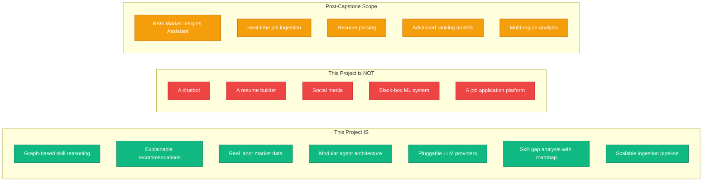

---

## 3. System Architecture Overview

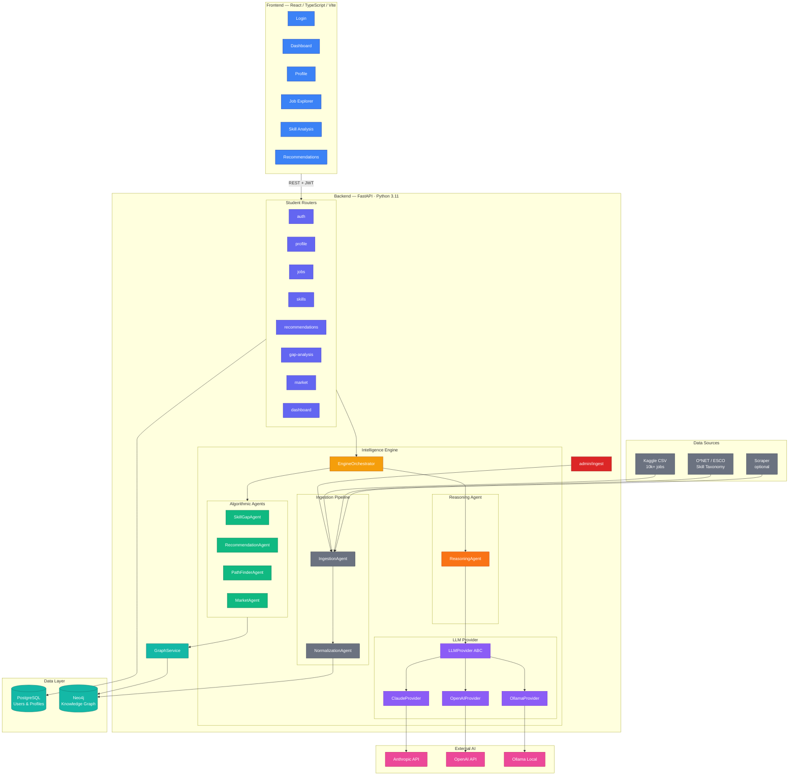

---

## 4. Technology Stack

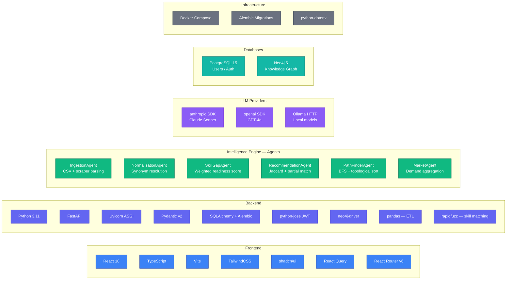

---

## 5. Frontend Architecture

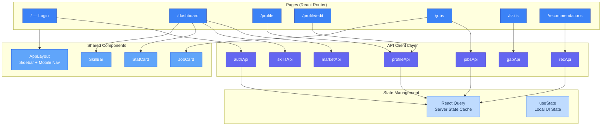

---

## 6. Backend Architecture

### File Structure

```
backend/
├── main.py                              # FastAPI app · CORS · routers
├── app/
│   ├── routers/
│   │   ├── auth.py
│   │   ├── profile.py
│   │   ├── jobs.py
│   │   ├── skills.py
│   │   ├── recommendations.py
│   │   ├── gap_analysis.py
│   │   ├── market.py
│   │   ├── dashboard.py
│   │   └── admin.py                     # POST /admin/ingest/csv
│   │
│   ├── engine/                          # ← Intelligence Engine
│   │   ├── orchestrator.py              # Coordinates all agents
│   │   │
│   │   ├── ingestion/                   # Data ingestion pipeline
│   │   │   ├── ingestion_agent.py       # CSV / scraper → validated records
│   │   │   └── normalization_agent.py   # Skill synonym resolution
│   │   │
│   │   ├── algorithmic/                 # Pure Python — no LLM
│   │   │   ├── skill_gap_agent.py       # Weighted readiness scoring
│   │   │   ├── recommendation_agent.py  # Jaccard + partial skill match
│   │   │   ├── path_finder_agent.py     # BFS + topological sort
│   │   │   └── market_agent.py          # Skill demand aggregation
│   │   │
│   │   ├── llm/                         # Pluggable LLM abstraction
│   │   │   ├── base.py                  # LLMProvider ABC
│   │   │   ├── claude_provider.py
│   │   │   ├── openai_provider.py
│   │   │   └── ollama_provider.py
│   │   │
│   │   └── reasoning/                   # LLM-powered narrative layer
│   │       └── reasoning_agent.py       # Explains all algorithmic outputs
│   │
│   ├── services/
│   │   └── graph_service.py             # All Cypher queries
│   │
│   ├── models/
│   │   ├── user.py
│   │   └── profile.py
│   │
│   ├── schemas/
│   │   ├── auth.py · profile.py · job.py · skill.py
│   │   ├── recommendation.py · gap_analysis.py
│   │   ├── market.py · dashboard.py · ingest.py
│   │
│   └── database/
│       ├── postgres.py
│       └── neo4j.py
│
└── data/
    ├── kaggle_jobs.csv                  # 10k+ real job postings
    ├── onet_skills.csv                  # O*NET skill taxonomy
    └── synonyms.json                    # Skill synonym map
```

### Router → Engine Flow

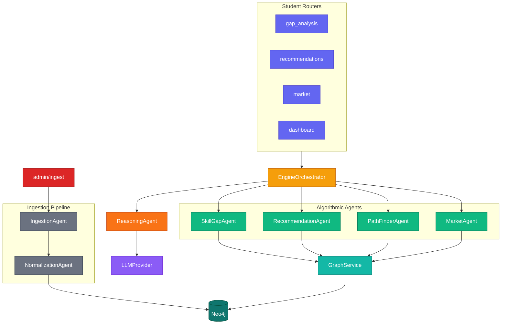

---

## 7. Database Design

### 7.1 PostgreSQL — Relational Schema

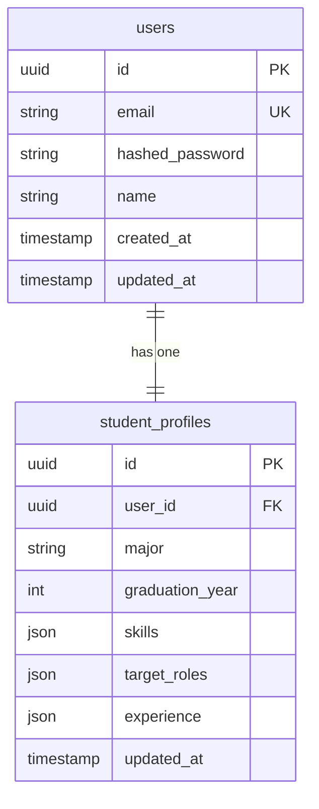

> **Why PostgreSQL for user data?** Auth and profile data is relational with strict uniqueness constraints and ACID requirements. Neo4j stores the *semantic* skill graph for traversal — both stores are synchronized on every profile update.

### 7.2 Neo4j — Knowledge Graph Schema

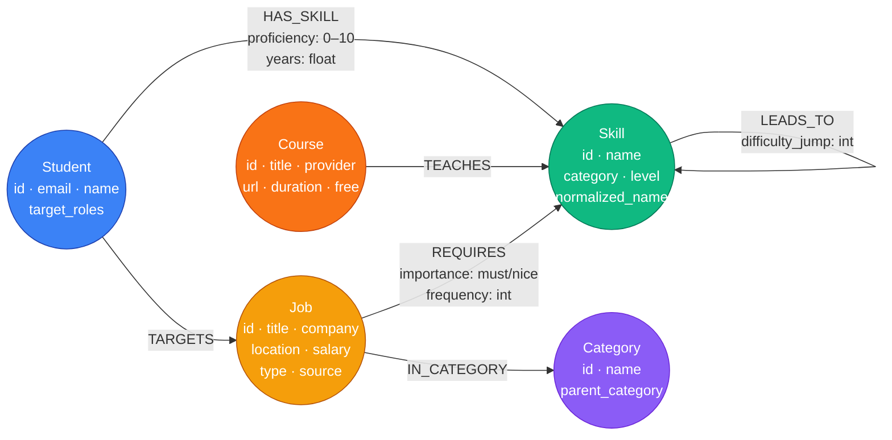

> **Key change from v2:** `(Course)-[:TEACHES]->(Skill)` is the natural subject-verb-object direction. A course *teaches* a skill, not the reverse.

> **NormalizationAgent** adds the `normalized_name` property to every Skill node and uses `rapidfuzz` fuzzy matching against the O*NET/ESCO skill taxonomy to resolve synonyms before graph insertion.

**Node counts:**
| Node | Demo Seed | Target (Kaggle) |
|------|-----------|-----------------|
| Student | 3 | — |
| Job | 50 | 10,000+ |
| Skill | 80 | 500+ (O*NET) |
| Course | 30 | 30 |
| Category | 7 | 20+ |

---

## 8. API Contract

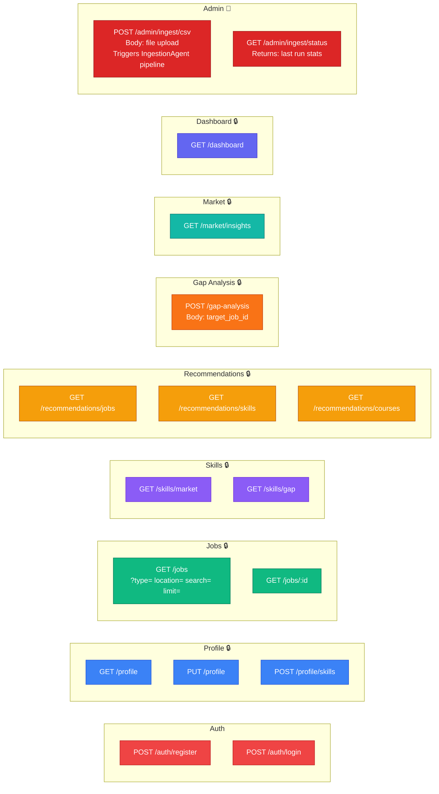

**Envelope — all responses:**
```json
{ "success": true,  "data": { ... }, "message": "Optional message" }
{ "success": false, "error": "NOT_FOUND", "message": "Job xyz does not exist" }
```

---

## 9. Intelligence Engine — Agent Architecture

### 9.1 Agent Overview

The engine is composed of four types of agents. Each type has a single responsibility. The ReasoningAgent is optional — removing it never breaks the system.

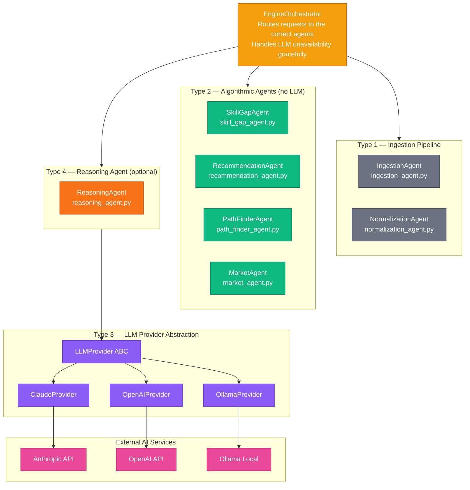

---

### 9.2 Ingestion Pipeline

The ingestion pipeline runs independently from the request cycle, triggered via `POST /admin/ingest/csv`.

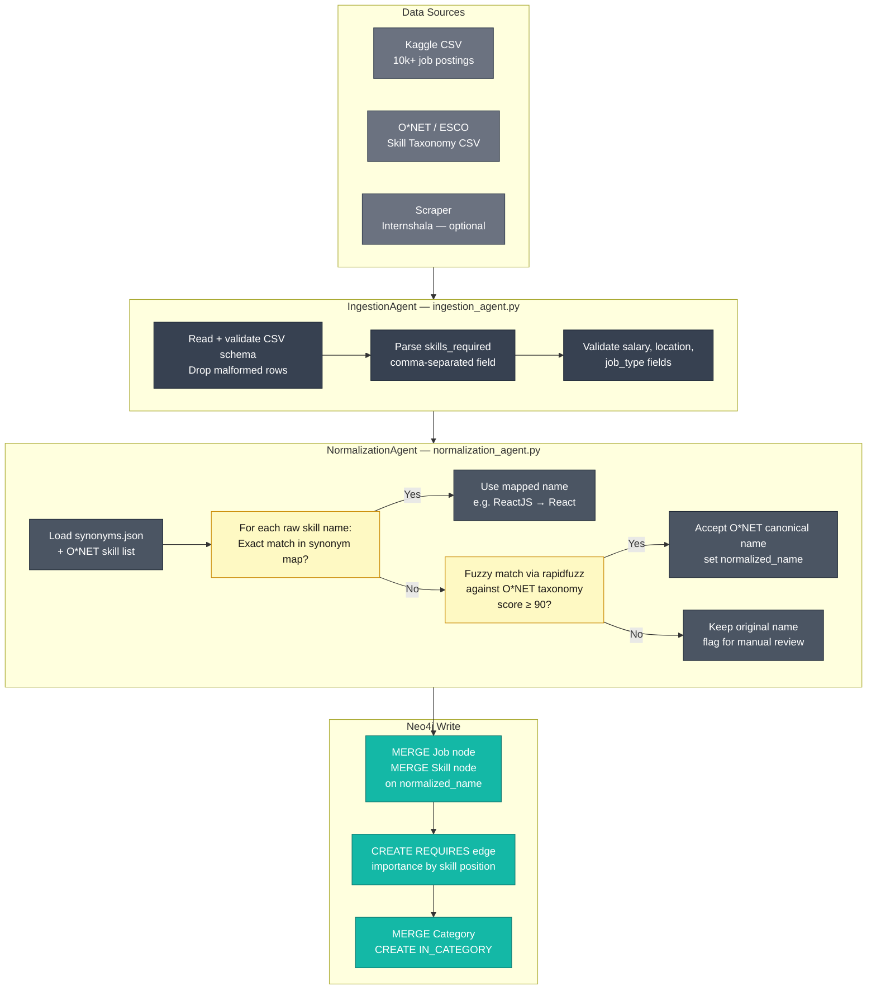

---

### 9.3 Algorithmic Agents

All four agents are pure Python — deterministic, unit-testable, zero network calls.

```mermaid
graph TB
    classDef agent fill:#10B981,stroke:#047857,color:#fff
    classDef input fill:#D1FAE5,stroke:#6EE7B7,color:#064E3B
    classDef out   fill:#A7F3D0,stroke:#34D399,color:#064E3B
    classDef graph fill:#14B8A6,stroke:#0F766E,color:#fff

    subgraph SGA["SkillGapAgent — skill_gap_agent.py"]
        SGA_IN["student_skills[]\nrequired_skills[]\nproficiency_map{}"]:::input
        SGA_CALC["readiness_score =\n  (must_matched / must_total) × 0.7\n+ (nice_matched / nice_total) × 0.3\n+ Σ proficiency_bonus"]:::agent
        SGA_OUT["readiness_score: 0–100\nmatched_skills[]\nmissing_skills[]"]:::out
        SGA_IN --> SGA_CALC --> SGA_OUT
    end

    subgraph RCA["RecommendationAgent — recommendation_agent.py"]
        RCA_IN["student_skills[]\nall_jobs[] from Neo4j"]:::input
        RCA_CALC["exact_score = |A ∩ B| / |A ∪ B|\npartial_score = graph proximity\n  via LEADS_TO within depth 2\nfinal_score = exact × 0.8 + partial × 0.2"]:::agent
        RCA_OUT["jobs[] ranked by\nfinal_score DESC"]:::out
        RCA_IN --> RCA_CALC --> RCA_OUT
    end

    subgraph PFA["PathFinderAgent — path_finder_agent.py"]
        PFA_IN["missing_skills[]\nLEADS_TO graph from Neo4j"]:::input
        PFA_CALC["BFS from each missing skill\nCollect prerequisite chains\nTopological sort → ordered path\nAttach TEACHES courses"]:::agent
        PFA_OUT["learning_path[]\nweeks_estimate per skill\ncourses per milestone"]:::out
        PFA_IN --> PFA_CALC --> PFA_OUT
    end

    subgraph MKA["MarketAgent — market_agent.py"]
        MKA_IN["All REQUIRES edges\nfrom Neo4j"]:::input
        MKA_CALC["demand_score =\n  REQUIRES count per Skill\n  normalized 0–100\ntrend = demand Δ over time"]:::agent
        MKA_OUT["skill_demand[]\ntrending_skills[]\ntop_categories[]"]:::out
        MKA_IN --> MKA_CALC --> MKA_OUT
    end

    NEO[(Neo4j)]:::graph
    NEO --> SGA_IN & RCA_IN & PFA_IN & MKA_IN
```

> **Partial skill matching in RecommendationAgent:** A student who knows Python gets partial credit toward a job requiring Machine Learning, because `Python → ML` exists as a `LEADS_TO` edge. Graph proximity within depth 2 is used as the partial match score.

---

### 9.4 LLM Provider Abstraction

```mermaid
graph TB
    classDef abc   fill:#8B5CF6,stroke:#6D28D9,color:#fff
    classDef impl  fill:#A78BFA,stroke:#7C3AED,color:#fff
    classDef ext   fill:#EC4899,stroke:#BE185D,color:#fff
    classDef conf  fill:#FEF9C3,stroke:#CA8A04,color:#1C1917

    BASE["LLMProvider — base.py\n\ncomplete(system, user, schema: BaseModel) → BaseModel\nstream(system, user) → Generator\nget_model_info() → ModelInfo"]:::abc

    CP["ClaudeProvider\nclaude_provider.py\n\nanthropic.Anthropic()\nJSON via tool_use"]:::impl
    OP["OpenAIProvider\nopenai_provider.py\n\nopenai.OpenAI()\nJSON via response_format"]:::impl
    OL["OllamaProvider\nollama_provider.py\n\nrequests.post(OLLAMA_URL)\nJSON schema in system prompt"]:::impl

    CLAUDE["Anthropic API\nclaude-sonnet-4-6"]:::ext
    OPENAI["OpenAI API\ngpt-4o"]:::ext
    LOCAL["Ollama\nlocalhost:11434\nllama3 / mistral"]:::ext

    ENV[".env\nLLM_PROVIDER = claude | openai | ollama\nLLM_MODEL = claude-sonnet-4-6 | gpt-4o | llama3"]:::conf

    BASE <|-- CP
    BASE <|-- OP
    BASE <|-- OL
    CP --> CLAUDE
    OP --> OPENAI
    OL --> LOCAL
    ENV --> CP & OP & OL
```

**The `complete()` contract — every provider returns a validated Pydantic model:**
```python
class LLMProvider(ABC):
    @abstractmethod
    def complete(
        self,
        system_prompt: str,
        user_prompt: str,
        output_schema: type[BaseModel],
        timeout: int = 30,
        retries: int = 2,
    ) -> BaseModel: ...
```

The ReasoningAgent never sees raw LLM output. The provider validates and parses into a schema before returning.

---

### 9.5 Reasoning Agent

The ReasoningAgent takes **algorithmic output** as input — it enriches, never replaces.

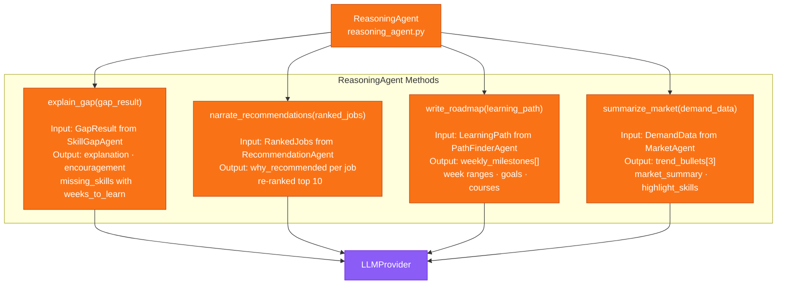

---

### 9.6 Engine Orchestrator

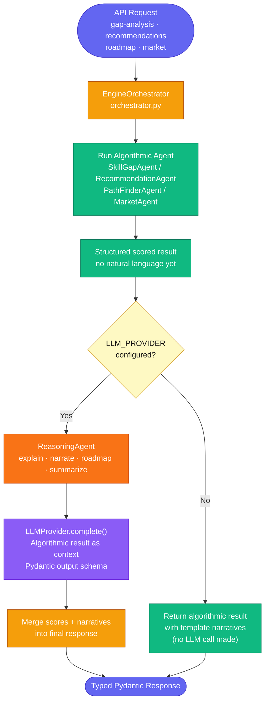

---

## 10. Data Sources

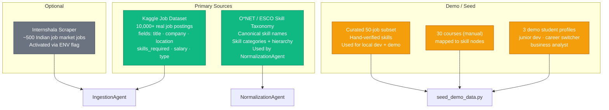

---

## 11. Data Flow Diagrams

### 11.1 Authentication Flow

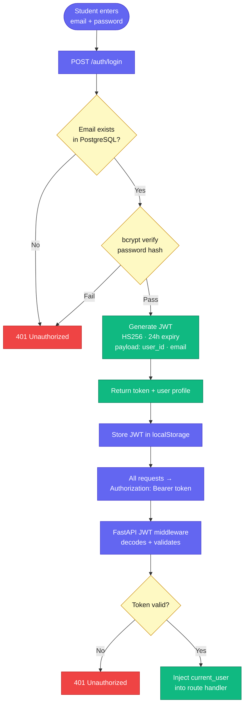

### 11.2 Recommendation Flow

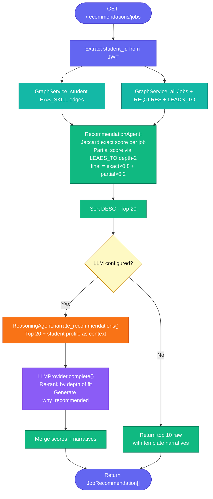

### 11.3 Skill Gap Analysis Flow

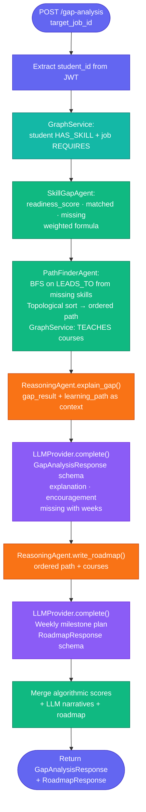

### 11.4 Ingestion Pipeline Flow

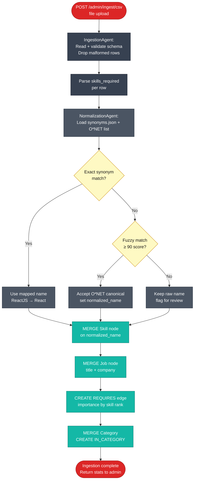

---

## 12. Sequence Diagrams

### 12.1 User Login & Dashboard Load

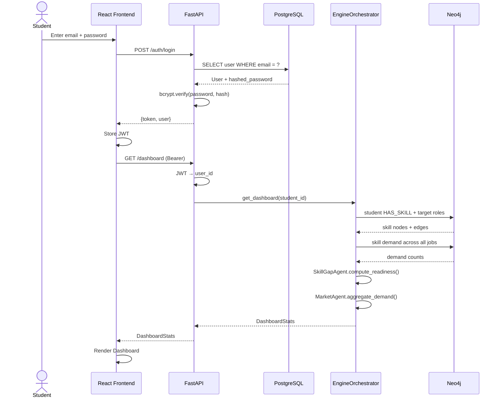

### 12.2 Skill Gap Analysis Request

```mermaid
sequenceDiagram
    actor U as Student
    participant FE as React Frontend
    participant API as FastAPI
    participant ALGO as Algorithmic Agents
    participant RA as ReasoningAgent
    participant LLM as LLMProvider
    participant NEO as Neo4j

    U->>FE: Navigate to Skill Analysis
    FE->>API: GET /skills/gap (Bearer)
    API->>ALGO: SkillGapAgent.compute_gap(student_id, job_id)
    ALGO->>NEO: student HAS_SKILL + job REQUIRES
    NEO-->>ALGO: both skill sets
    ALGO->>ALGO: Compute readiness_score · matched · missing
    ALGO->>ALGO: PathFinderAgent.find_path(missing)
    ALGO->>NEO: BFS on LEADS_TO + TEACHES courses
    NEO-->>ALGO: ordered path + courses
    ALGO-->>API: GapResult (algorithmic)

    API->>RA: explain_gap(gap_result)
    RA->>LLM: complete(system, gap_context, GapSchema)
    Note over LLM: Claude / OpenAI / Ollama
    LLM-->>RA: explanation + encouragement + weeks
    RA->>LLM: complete(system, path_context, RoadmapSchema)
    LLM-->>RA: weekly milestones + courses
    RA-->>API: GapAnalysisResponse + RoadmapResponse
    API-->>FE: Full response
    FE->>FE: Render Skill Analysis
```

### 12.3 Job Recommendation Request

```mermaid
sequenceDiagram
    actor U as Student
    participant FE as React Frontend
    participant API as FastAPI
    participant ALGO as RecommendationAgent
    participant RA as ReasoningAgent
    participant LLM as LLMProvider
    participant NEO as Neo4j

    U->>FE: Navigate to Recommendations
    FE->>API: GET /recommendations/jobs?limit=10
    API->>ALGO: rank_jobs(student_id)
    ALGO->>NEO: all Jobs + REQUIRES + LEADS_TO
    NEO-->>ALGO: job + skill graph
    ALGO->>ALGO: Jaccard exact score per job
    ALGO->>ALGO: Partial score via LEADS_TO depth-2
    ALGO->>ALGO: final = exact×0.8 + partial×0.2 · sort DESC
    ALGO-->>API: Top 20 ranked jobs

    API->>RA: narrate_recommendations(top20, student)
    RA->>LLM: complete(system, candidates_context, NarratorSchema)
    Note over LLM: Re-rank by nuanced fit<br/>Generate why_recommended per job
    LLM-->>RA: top 10 + narratives
    RA-->>API: JobRecommendation[]
    API-->>FE: JobRecommendation[]
    FE->>FE: Render job cards
```

---

## 13. Component Diagram

```mermaid
graph TB
    classDef frontend fill:#3B82F6,stroke:#1E40AF,color:#fff
    classDef layout   fill:#60A5FA,stroke:#2563EB,color:#fff
    classDef router   fill:#6366F1,stroke:#4338CA,color:#fff
    classDef admin    fill:#DC2626,stroke:#991B1B,color:#fff
    classDef orch     fill:#F59E0B,stroke:#B45309,color:#fff
    classDef ingest   fill:#6B7280,stroke:#374151,color:#fff
    classDef algo     fill:#10B981,stroke:#047857,color:#fff
    classDef reason   fill:#F97316,stroke:#C2410C,color:#fff
    classDef llm      fill:#8B5CF6,stroke:#6D28D9,color:#fff
    classDef db       fill:#14B8A6,stroke:#0F766E,color:#fff

    subgraph FRONTEND["Frontend Application"]
        subgraph PAGES["Pages"]
            LOGIN[Login]:::frontend
            DASH[Dashboard]:::frontend
            PROF[Profile · Edit]:::frontend
            JOBS[Job Explorer]:::frontend
            SKILLS[Skill Analysis]:::frontend
            RECS[Recommendations]:::frontend
        end
        SIDEBAR[AppLayout Sidebar]:::layout
        CARDS[StatCard · SkillBar · JobCard]:::layout
    end

    subgraph BACKEND["Backend Application"]
        subgraph FAST["FastAPI Layer"]
            JWT_MW[JWT Middleware]:::router
            CORS_MW[CORS Middleware]:::router
        end

        subgraph ROUTES["Student Routers"]
            R_A[auth]:::router
            R_P[profile]:::router
            R_J[jobs]:::router
            R_REC[recommendations]:::router
            R_G[gap-analysis]:::router
            R_M[market]:::router
        end

        R_ADM[admin/ingest]:::admin
        ORCHESTR[EngineOrchestrator]:::orch

        subgraph ING["Ingestion Pipeline"]
            IAG[IngestionAgent]:::ingest
            NAG[NormalizationAgent]:::ingest
        end

        subgraph ALGOS["Algorithmic Agents"]
            SGA[SkillGapAgent]:::algo
            RCA[RecommendationAgent]:::algo
            PFA[PathFinderAgent]:::algo
            MKA[MarketAgent]:::algo
        end

        RAG[ReasoningAgent]:::reason

        subgraph LLMP["LLM Providers"]
            CLP[ClaudeProvider]:::llm
            OAP[OpenAIProvider]:::llm
            OLP[OllamaProvider]:::llm
        end

        GRS[GraphService]:::db
    end

    subgraph DATA["Data Stores"]
        PGS[(PostgreSQL)]:::db
        NEO[(Neo4j)]:::db
    end

    SIDEBAR --> PAGES --> JWT_MW
    JWT_MW --> ROUTES & R_ADM
    ROUTES --> ORCHESTR
    R_ADM --> IAG --> NAG --> NEO
    ORCHESTR --> ALGOS & RAG
    RAG --> CLP & OAP & OLP
    ALGOS --> GRS --> NEO
    R_A & R_P --> PGS
```

---

## 14. Deployment Architecture

```mermaid
graph TB
    classDef fe    fill:#3B82F6,stroke:#1E40AF,color:#fff
    classDef api   fill:#6366F1,stroke:#4338CA,color:#fff
    classDef db    fill:#14B8A6,stroke:#0F766E,color:#fff
    classDef env   fill:#FEF9C3,stroke:#CA8A04,color:#1C1917
    classDef ext   fill:#EC4899,stroke:#BE185D,color:#fff
    classDef local fill:#8B5CF6,stroke:#6D28D9,color:#fff

    subgraph LOCAL["Local Development — Docker Compose"]
        FE_DEV["React Dev Server\nlocalhost:5173"]:::fe
        API_DEV["FastAPI + Uvicorn\nlocalhost:8000 --reload"]:::api
        PG_DEV["PostgreSQL 15\nlocalhost:5432"]:::db
        NEO_DEV["Neo4j 5\nlocalhost:7474 HTTP\nlocalhost:7687 Bolt"]:::db
        OLLAMA_DEV["Ollama (optional)\nlocalhost:11434"]:::local
    end

    subgraph ENV[".env"]
        E1[DATABASE_URL]:::env
        E2[NEO4J_URI / USER / PASSWORD]:::env
        E3[ANTHROPIC_API_KEY]:::env
        E4[OPENAI_API_KEY]:::env
        E5[JWT_SECRET]:::env
        E6[LLM_PROVIDER / LLM_MODEL]:::env
        E7[FRONTEND_URL]:::env
    end

    subgraph CLOUD["External AI (optional)"]
        ANT["Anthropic API"]:::ext
        OAI["OpenAI API"]:::ext
    end

    FE_DEV -->|API calls| API_DEV
    API_DEV --> PG_DEV & NEO_DEV
    API_DEV -->|if claude| ANT
    API_DEV -->|if openai| OAI
    API_DEV -->|if ollama| OLLAMA_DEV
    ENV --> API_DEV
```

**Startup sequence:**
```
1. docker-compose up -d                        # PostgreSQL + Neo4j (+ Ollama optional)
2. alembic upgrade head                         # PG schema migrations
3. python -m app.engine.ingestion.ingestion_agent  # Load Kaggle CSV + O*NET
4. python -m app.etl.seed_demo_data             # Seed 3 demo students + 30 courses
5. uvicorn app.main:app --reload                # API on :8000
6. cd frontend && npm run dev                   # React on :5173
```

---

## 15. Security Design

```mermaid
graph LR
    classDef threat  fill:#EF4444,stroke:#B91C1C,color:#fff
    classDef control fill:#10B981,stroke:#047857,color:#fff

    subgraph THREATS["Threats"]
        T1[SQL Injection]:::threat
        T2[JWT Forgery]:::threat
        T3[Cross-Origin Requests]:::threat
        T4[Unauthorized Data Access]:::threat
        T5[Prompt Injection]:::threat
        T6[Cypher Injection]:::threat
    end

    subgraph CONTROLS["Controls"]
        C1[SQLAlchemy ORM\nparameterized queries]:::control
        C2[HS256 signed JWT · 24h expiry]:::control
        C3[FastAPI CORS · allowed origins from .env]:::control
        C4[JWT middleware on all protected routes\nstudent_id from token only — never from request]:::control
        C5[LLMProvider Pydantic schema enforcement\nfallback on parse failure\nno business logic inside LLM]:::control
        C6[neo4j-driver parameterized Cypher\n$param syntax only]:::control
    end

    T1 --> C1
    T2 --> C2
    T3 --> C3
    T4 --> C4
    T5 --> C5
    T6 --> C6
```

---

## 16. Data Models — API Contracts

```mermaid
classDiagram
    class StudentProfile {
        +str id
        +str name
        +str email
        +str major
        +int graduation_year
        +List~SkillEntry~ skills
        +List~str~ target_roles
        +List~ExperienceItem~ experience
    }

    class SkillEntry {
        +str name
        +int proficiency
        +float years
    }

    class ExperienceItem {
        +str title
        +str company
        +str duration
        +str description
    }

    class Job {
        +str id
        +str title
        +str company
        +str location
        +str type
        +List~str~ required_skills
        +float match_percentage
        +str description
        +str why_recommended
        +int salary_min
        +int salary_max
    }

    class GapAnalysisResponse {
        +int readiness_score
        +List~str~ matched_skills
        +List~MissingSkill~ missing_skills
        +str explanation
        +str encouragement
        +List~Milestone~ roadmap
    }

    class MissingSkill {
        +str skill_name
        +str importance
        +int estimated_learning_weeks
    }

    class Milestone {
        +str week_range
        +str skill_name
        +str course_title
        +str course_url
        +str goal
    }

    class DashboardStats {
        +int job_readiness_score
        +int skills_matched
        +int total_required_skills
        +List~str~ missing_high_demand_skills
        +List~SkillDemand~ market_demand
    }

    class MarketInsights {
        +List~SkillDemand~ top_skills
        +List~str~ trend_bullets
        +str summary
    }

    class LLMProvider {
        <<abstract>>
        +complete(system, user, schema) BaseModel
        +stream(system, user) Generator
        +get_model_info() ModelInfo
    }

    class ClaudeProvider {
        +model: str
        +complete(system, user, schema) BaseModel
    }

    class OpenAIProvider {
        +model: str
        +complete(system, user, schema) BaseModel
    }

    class OllamaProvider {
        +model: str
        +base_url: str
        +complete(system, user, schema) BaseModel
    }

    StudentProfile "1" --> "*" SkillEntry
    StudentProfile "1" --> "*" ExperienceItem
    GapAnalysisResponse "1" --> "*" MissingSkill
    GapAnalysisResponse "1" --> "*" Milestone
    DashboardStats "1" --> "*" SkillDemand
    MarketInsights "1" --> "*" SkillDemand
    LLMProvider <|-- ClaudeProvider
    LLMProvider <|-- OpenAIProvider
    LLMProvider <|-- OllamaProvider
```

---

*End of System Design Document — Version 3.0*
